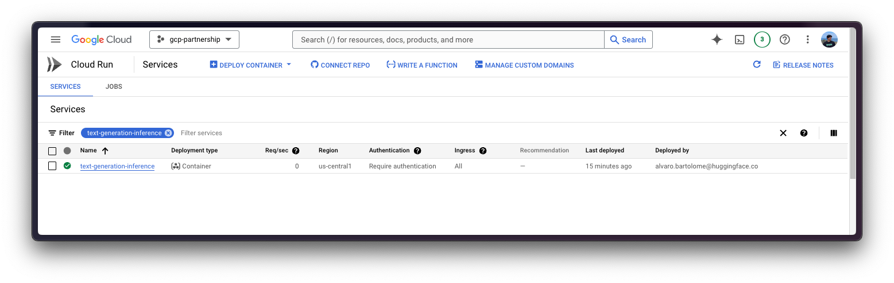
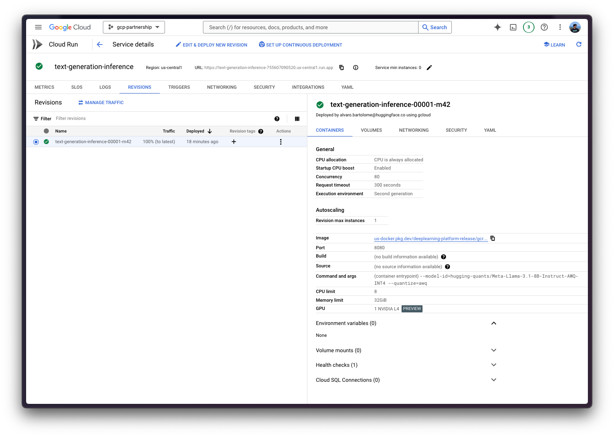

# Deploy Meta Llama 3.1 8B with Text Generation Inference on Cloud Run

Meta Llama 3.1 is the latest open LLM from Meta, released in July 2024. Meta Llama 3.1 comes in three sizes: 8B for efficient deployment and development on consumer-size GPU, 70B for large-scale AI native applications, and 405B for synthetic data, LLM as a Judge or distillation; among other use cases. Text Generation Inference (TGI) is a toolkit developed by Hugging Face for deploying and serving LLMs, with high performance text generation. Google Cloud Run is a serverless container platform that allows developers to deploy and manage containerized applications without managing infrastructure, enabling automatic scaling and billing only for usage. This example showcases how to deploy an LLM from the Hugging Face Hub, in this case Meta Llama 3.1 8B Instruct model quantized to INT4 using AWQ, with the Hugging Face DLC for TGI on Google Cloud Run with GPU support (on preview).

> [!NOTE]
> GPU support on Cloud Run is only available as a waitlisted public preview. If you're interested in trying out the feature, [request a quota increase](https://cloud.google.com/run/quotas#increase) for `Total Nvidia L4 GPU allocation, per project per region`. At the time of writing this example, NVIDIA L4 GPUs (24GiB VRAM) are the only available GPUs on Cloud Run; enabling automatic scaling up to 7 instances by default (more available via quota), as well as scaling down to zero instances when there are no requests.

## Setup / Configuration

First, you need to install `gcloud` in your local machine, which is the command-line tool for Google Cloud, following the instructions at [Cloud SDK Documentation - Install the gcloud CLI](https://cloud.google.com/sdk/docs/install).

Optionally, to ease the usage of the commands within this tutorial, you need to set the following environment variables for GCP:

```bash
export PROJECT_ID=your-project-id
export LOCATION=us-central1 # or any location where Cloud Run offers GPUs: https://cloud.google.com/run/docs/locations#gpu
export CONTAINER_URI=us-docker.pkg.dev/deeplearning-platform-release/gcr.io/huggingface-text-generation-inference-cu121.2-2.ubuntu2204.py310
export SERVICE_NAME=text-generation-inference
```

Then you need to login into your Google Cloud account and set the project ID you want to use to deploy Cloud Run.

```bash
gcloud auth login
gcloud auth application-default login  # For local development
gcloud config set project $PROJECT_ID
```

Once you are logged in, you need to enable the Cloud Run API, which is required for the Hugging Face DLC for TGI deployment on Cloud Run.

```bash
gcloud services enable run.googleapis.com
```

## Deploy TGI on Cloud Run

Once you are all set, you can call the `gcloud beta run deploy` command (still on beta because GPU support is on preview, as mentioned above).

The `gcloud beta run deploy` command needs you to specify the following parameters:

- `--image`: The container image URI to deploy.
- `--args`: The arguments to pass to the container entrypoint, being `text-generation-launcher` for the Hugging Face DLC for TGI. Read more about the supported arguments at [Text-generation-launcher arguments](https://huggingface.co/docs/text-generation-inference/en/basic_tutorials/launcher).
  - `--model-id`: The model ID to use, in this case, [`hugging-quants/Meta-Llama-3.1-8B-Instruct-AWQ-INT4`](https://huggingface.co/hugging-quants/Meta-Llama-3.1-8B-Instruct-AWQ-INT4).
  - `--quantize`: The quantization method to use, in this case, `awq`. If not specified, it will be retrieved from the `quantization_config->quant_method` in the `config.json` file.
- `--port`: The port the container listens to.
- `--cpu` and `--memory`: The number of CPUs and amount of memory to allocate to the container. Needs to be set to 8 and 32GiB, respectively; as that's a requirement for using the GPU.
- `--no-cpu-throttling`: Disables CPU throttling, which is required for using the GPU.
- `--gpu` and `--gpu-type`: The number of GPUs and the GPU type to use. Needs to be set to 1 and `nvidia-l4`, respectively; as at the time of writing this tutorial, those are the only available options as Cloud Run on GPUs is still under preview.
- `--max-instances`: The maximum number of instances to run, set to 3, but default value is 7. Alternatively, one could set it to 1 too, but that could eventually lead to downtime during infrastructure migrations, so anything above 1 is recommended.
- `--concurrency`: the maximum number of concurrent requests per instance, set to 64. The value is not arbitrary, but determined after running and evaluating the results of [`text-generation-benchmark`](https://github.com/huggingface/text-generation-inference/tree/main/benchmark), as the most optimal balance between throughput and latency; where the current default for TGI being 128 is a bit too much. Note that this value is also aligned with the [`--max-concurrent-requests`](https://huggingface.co/docs/text-generation-inference/en/basic_tutorials/launcher#maxconcurrentrequests) argument in TGI.
- `--region`: The region to deploy the Cloud Run service.
- `--no-allow-unauthenticated`: Disables unauthenticated access to the service, which is a good practice as adds an authentication layer managed by Google Cloud IAM.

```bash
gcloud beta run deploy $SERVICE_NAME \
    --image=$CONTAINER_URI \
    --args="--model-id=hugging-quants/Meta-Llama-3.1-8B-Instruct-AWQ-INT4,--quantize=awq,--max-concurrent-requests=64" \
    --port=8080 \
    --cpu=8 \
    --memory=32Gi \
    --no-cpu-throttling \
    --gpu=1 \
    --gpu-type=nvidia-l4 \
    --max-instances=3 \
    --concurrency=64 \
    --region=$LOCATION \
    --no-allow-unauthenticated
```





> [!NOTE]
> The first time you deploy a new container on Cloud Run it will take around 5 minutes to deploy as it needs to import it from the Google Cloud Artifact Registry, but on the follow up deployments it will take less time as the image has been already imported before.

## Inference on Cloud Run

Once deployed, you can send requests to the service via any of the supported TGI endpoints, check [TGI's OpenAPI Specification](https://huggingface.github.io/text-generation-inference/) to see all the available endpoints and their respective parameters.

All Cloud Run services are deployed privately by default, which means that they can't be accessed without providing authentication credentials in the request headers. These services are secured by IAM and are only callable by Project Owners, Project Editors, and Cloud Run Admins and Cloud Run Invokers.

In this case, a couple of alternatives to enable developer access will be showcased; while the other use cases are out of the scope of this example, as those are either not secure due to the authentication being disabled (for public access scenarios), or require additional setup for a production-ready scenarios (service-to-service authentication, end-user access).

> [!NOTE]
> The alternatives mentioned below are for development scenarios, and should not be used in production-ready scenarios as is. The approach below is following the guide defined in [Cloud Run Documentation - Authenticate Developers](https://cloud.google.com/run/docs/authenticating/developers); but you can find every other guide as mentioned above in [Cloud Run Documentation - Authentication overview](https://cloud.google.com/run/docs/authenticating/overview).

### Via Cloud Run Proxy

Cloud Run Proxy runs a server on localhost that proxies requests to the specified Cloud Run Service with credentials attached; which is useful for testing and experimentation.

```bash
gcloud run services proxy $SERVICE_NAME --region $LOCATION
```

Then you can send requests to the deployed service on Cloud Run, using the <http://localhost:8080> URL, with no authentication, exposed by the proxy as shown in the examples below.

> [!NOTE]
> Note that the examples below are using the `/v1/chat/completions` TGI endpoint with is OpenAI-compatible, meaning that both `cURL` and Python are just some proposals, but any OpenAI-compatible client can be used instead.

#### cURL

To send a POST request to the TGI service using `cURL`, you can run the following command:

```bash
curl http://localhost:8080/v1/chat/completions \
    -X POST \
    -H 'Content-Type: application/json' \
    -d '{
        "model": "tgi",
        "messages": [
            {
                "role": "system",
                "content": "You are a helpful assistant."
            },
            {
                "role": "user",
                "content": "What is Deep Learning?"
            }
        ],
        "max_tokens": 128
    }'
```

#### Python

To run the inference using Python, you can either use the `huggingface_hub` Python SDK (recommended) or the `openai` Python SDK.

##### `huggingface_hub`

You can install it via `pip` as `pip install --upgrade --quiet huggingface_hub`, and then run:

```python
from huggingface_hub import InferenceClient

client = InferenceClient(base_url="http://localhost:8080", api_key="-")

chat_completion = client.chat.completions.create(
  model="hugging-quants/Meta-Llama-3.1-8B-Instruct-AWQ-INT4",
  messages=[
    {"role": "system", "content": "You are a helpful assistant."},
    {"role": "user", "content": "What is Deep Learning?"},
  ],
  max_tokens=128,
)
```

##### `openai`

You can install it via `pip` as `pip install --upgrade openai`, and then run:

```python
from openai import OpenAI

client = OpenAI(
    base_url="http://localhost:8080/v1/",
    api_key="-",
)

chat_completion = client.chat.completions.create(
    model="tgi",
    messages=[
        {"role": "system", "content": "You are a helpful assistant."},
        {"role": "user", "content": "What is Deep Learning?"},
    ],
    max_tokens=128,
)
```

### (recommended) Via Cloud Run Service URL

Cloud Run Service has an unique URL assigned that can be used to send requests from anywhere, using the Google Cloud Credentials with Cloud Run Invoke access to the service; which is the recommended approach as it's more secure and consistent than using the Cloud Run Proxy.

The URL of the Cloud Run service can be obtained via the following command (assigned to the `SERVICE_URL` variable for convenience):

```bash
SERVICE_URL=$(gcloud run services describe $SERVICE_NAME --region $LOCATION --format 'value(status.url)')
```

Then you can send requests to the deployed service on Cloud Run, using the `SERVICE_URL` and any Google Cloud Credentials with Cloud Run Invoke access. For setting up the credentials there are multiple approaches, some of those are listed below:

- Using the default identity token from the Google Cloud SDK:

  - Via `gcloud` as:

  ```bash
  gcloud auth print-identity-token
  ```

  - Via Python as:

  ```python
  import google.auth
  from google.auth.transport.requests import Request as GoogleAuthRequest

  auth_req = GoogleAuthRequest()
  creds, _ = google.auth.default()
  creds.refresh(auth_req)

  id_token = creds.id_token
  ```

- Using a Service Account with Cloud Run Invoke access, which can either be done with any of the following approaches:
  - Create a Service Account before the Cloud Run Service was created, and then set the `--service-account` flag to the Service Account email when creating the Cloud Run Service. And use an Access Token for that Service Account only using `gcloud auth print-access-token --impersonate-service-account=SERVICE_ACCOUNT_EMAIL`.
  - Create a Service Account after the Cloud Run Service was created, and then update the Cloud Run Service to use the Service Account. And use an Access Token for that Service Account only using `gcloud auth print-access-token --impersonate-service-account=SERVICE_ACCOUNT_EMAIL`.

The recommended approach is to use a Service Account (SA), as the access can be controlled better and the permissions are more granular; as the Cloud Run Service was not created using a SA, which is another nice option, you need to now create the SA, gran it the necessary permissions, update the Cloud Run Service to use the SA, and then generate an access token to set as the authentication token within the requests, that can be revoked later once you are done using it.

- Set the `SERVICE_ACCOUNT_NAME` environment variable for convenience:

  ```bash
  export SERVICE_ACCOUNT_NAME=text-generation-inference-invoker
  ```

- Create the Service Account:

  ```bash
  gcloud iam service-accounts create $SERVICE_ACCOUNT_NAME
  ```

- Grant the Service Account the Cloud Run Invoker role:

  ```bash
  gcloud run services add-iam-policy-binding $SERVICE_NAME \
      --member="serviceAccount:$SERVICE_ACCOUNT_NAME@$PROJECT_ID.iam.gserviceaccount.com" \
      --role="roles/run.invoker" \
      --region=$LOCATION
  ```

- Update the Cloud Run service to use the Service Account:

  ```bash
  gcloud run services update $SERVICE_NAME \
      --service-account $SERVICE_ACCOUNT_NAME@$PROJECT_ID.iam.gserviceaccount.com \
      --region=$REGION
  ```

- Generate the Access Token for the Service Account:

  ```bash
  export ACCESS_TOKEN=$(gcloud auth print-access-token --impersonate-service-account=$SERVICE_ACCOUNT_NAME@$PROJECT_ID.iam.gserviceaccount.com)
  ```

> [!WARNING]
> The access token is short-lived and will expire, typically after 1 hour; if you want to extend the lifetime of the token you can do so via the `--lifetime` argument within the same command, up until 12 hours (value needs to be specified in seconds). Otherwise, you can also generate a new token by running the same command again.

Now you can already dive into the different alternatives for sending the requests to the deployed Cloud Run Service using the `SERVICE_URL` AND `ACCESS_TOKEN` as described above.

> [!NOTE]
> Note that the examples below are using the `/v1/chat/completions` TGI endpoint with is OpenAI-compatible, meaning that both `cURL` and Python are just some proposals, but any OpenAI-compatible client can be used instead.

#### cURL

To send a POST request to the TGI service using `cURL`, you can run the following command:

```bash
curl $SERVICE_URL/v1/chat/completions \
    -X POST \
    -H 'Authorization: Bearer $ACCESS_TOKEN' \
    -H 'Content-Type: application/json' \
    -d '{
        "model": "tgi",
        "messages": [
            {
                "role": "system",
                "content": "You are a helpful assistant."
            },
            {
                "role": "user",
                "content": "What is Deep Learning?"
            }
        ],
        "max_tokens": 128
    }'
```

#### Python

To run the inference using Python, you can either use the `huggingface_hub` Python SDK (recommended) or the `openai` Python SDK.

##### `huggingface_hub`

You can install it via `pip` as `pip install --upgrade --quiet huggingface_hub`, and then run:

```python
import os
from huggingface_hub import InferenceClient

client = InferenceClient(
    base_url=os.getenv("SERVICE_URL"),
    api_key=os.getenv("ACCESS_TOKEN"),
)

chat_completion = client.chat.completions.create(
  model="hugging-quants/Meta-Llama-3.1-8B-Instruct-AWQ-INT4",
  messages=[
    {"role": "system", "content": "You are a helpful assistant."},
    {"role": "user", "content": "What is Deep Learning?"},
  ],
  max_tokens=128,
)
```

##### `openai`

You can install it via `pip` as `pip install --upgrade openai`, and then run:

```python
import os
from openai import OpenAI

client = OpenAI(
    base_url=os.getenv("SERVICE_URL"),
    api_key=os.getenv("ACCESS_TOKEN"),
)

chat_completion = client.chat.completions.create(
    model="tgi",
    messages=[
        {"role": "system", "content": "You are a helpful assistant."},
        {"role": "user", "content": "What is Deep Learning?"},
    ],
    max_tokens=128,
)
```

## Resource clean up

Finally, once you are done using TGI on the Cloud Run Service, you can safely delete it to avoid incurring in unnecessary costs e.g. if the Cloud Run services are inadvertently invoked more times than your monthly Cloud Run invokement allocation in the free tier.

To delete the Cloud Run Service you can either go to the Google Cloud Console at <https://console.cloud.google.com/run> and delete it manually; or use the Google Cloud SDK via `gcloud` as follows:

```bash
gcloud run services delete $SERVICE_NAME --region $LOCATION
```

If you prefer to scale it down to zero instances without deleting it, you can use the following command:

```bash
gcloud run services update $SERVICE_NAME --region $LOCATION --platform managed --max-instances 0
```

Additionally, if you followed the steps in [via Cloud Run Service URL](#via-cloud-run-service-url) and generated a Service Account and an access token, you can either remove the Service Account, or just revoke the access token if it is still valid.

- (recommended) Revoke the Access Token as

```bash
gcloud auth revoke --impersonate-service-account=$SERVICE_ACCOUNT_NAME@$PROJECT_ID.iam.gserviceaccount.com
```

- (optional) Delete the Service Account as:

```bash
gcloud iam service-accounts delete $SERVICE_ACCOUNT_NAME@$PROJECT_ID.iam.gserviceaccount.com
```

## References

- [Cloud Run Documentation - Overview](https://cloud.google.com/run/docs)
- [Google Cloud Blog - Run your AI inference applications on Cloud Run with NVIDIA GPUs](https://cloud.google.com/blog/products/application-development/run-your-ai-inference-applications-on-cloud-run-with-nvidia-gpus)
