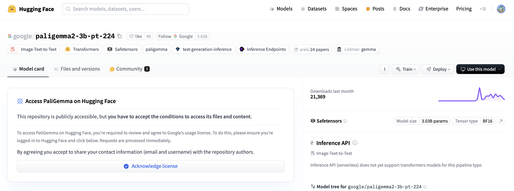
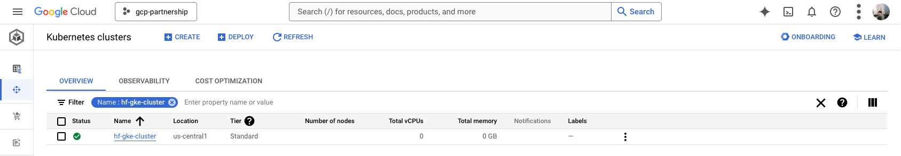
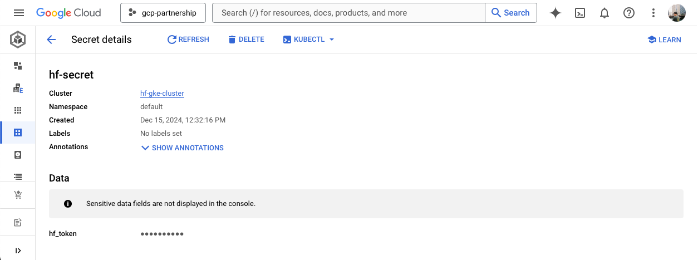
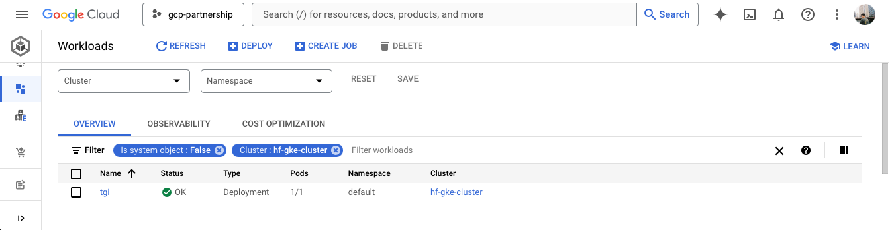

# Deploy PaliGemma2 with TGI DLC on GKE

PaliGemma 2 is an updated multilingual vision-language model that combines the Gemma 2 language model with the SigLIP vision model, enabling it to process both images and text inputs to generate text outputs for various tasks including captioning, visual question answering, and object detection. Text Generation Inference (TGI) is a toolkit developed by Hugging Face for deploying and serving LLMs, with high performance text generation. And, Google Kubernetes Engine (GKE) is a fully-managed Kubernetes service in Google Cloud that can be used to deploy and operate containerized applications at scale using Google Cloud infrastructure.

This example showcases how to deploy Google PaliGemma2 from the Hugging Face Hub on a GKE Cluster, running a purpose-built container to deploy LLMs and VLMs in a secure and managed environment with the Hugging Face DLC for TGI. Additionally, this example also presents different scenarios or use-cases where PaliGemma2 can be used.

## Setup / Configuration

> [!NOTE]
> Some configuration steps such as the `gcloud`, `kubectl`, and `gke-cloud-auth-plugin` installation are not required if running the example within the Google Cloud Cloud Shell, as the spawned shell already comes with those dependencies installed; as well as logged in within the current account and project selected on Google Cloud. 

Optionally, to avoid duplicating the following values within this example, for convenience you should set the following environment variable with your own Google Cloud values:

```bash
export PROJECT_ID=your-project-id
export LOCATION=your-location
export CLUSTER_NAME=your-cluster-name
```

### Requirements

First, you need to install both `gcloud` and `kubectl` in your local machine, which are the command-line tools for Google Cloud and Kubernetes, respectively, to interact with the Google Cloud and the GKE Cluster.

- To install `gcloud`, follow the instructions at [Cloud SDK Documentation - Install the gcloud CLI](https://cloud.google.com/sdk/docs/install).
- To install `kubectl`, follow the instructions at [Kubernetes Documentation - Install Tools](https://kubernetes.io/docs/tasks/tools/#kubectl).

Additionally, to use `kubectl` with the GKE Cluster credentials, you also need to install the `gke-gcloud-auth-plugin`, that can be installed with `gcloud` as follows:

```bash
gcloud components install gke-gcloud-auth-plugin
```

> [!NOTE]
> Installing the `gke-gcloud-auth-plugin` does not need to be installed via `gcloud` specifically, to read more about the alternative installation methods, please visit the [GKE Documentation - Install kubectl and configure cluster access](https://cloud.google.com/kubernetes-engine/docs/how-to/cluster-access-for-kubectl#install_plugin).

### Login and API enablement

Then you need to login into your Google Cloud account and set the project ID to the one you want to use for the deployment of the GKE Cluster.

```bash
gcloud auth login
gcloud auth application-default login  # Required for local development
gcloud config set project $PROJECT_ID
```

Once you are logged in, you need to enable the necessary service APIs in Google Cloud, such as the Google Kubernetes Engine API, the Google Container Registry API, and the Google Container File System API, which are necessary for the deployment of the GKE Cluster and the Hugging Face DLC for TGI.

```bash
gcloud services enable container.googleapis.com
gcloud services enable containerregistry.googleapis.com
gcloud services enable containerfilesystem.googleapis.com
```

### PaliGemma2 gating and Hugging Face access token

As [`google/paligemma2-3b-pt-224`](https://huggingface.co/google/paligemma2-3b-pt-224) is a gated model, as well as the rest of the PaliGemma2 released weights on the Hugging Face Hub (see them all in [the Google PaliGemma2 Collection on the Hub](https://huggingface.co/collections/google/paligemma-2-release-67500e1e1dbfdd4dee27ba48)), you need to first accept their gating / licensing in the model card, in order to be able to download the weights.



Once you have been granted access to the PaliGemma2 model on the Hub, you should be able to generate either a fine-grained or a read-access token to be able to download [`google/paligemma2-3b-pt-224`](https://huggingface.co/google/paligemma2-3b-pt-224) model weights (or every model under the [`google`](https://huggingface.co/google) organization on the Hub), or to all the models your account has access to, respectively. To generate access tokens for the Hugging Face Hub you can follow the instructions at [Hugging Face Hub Documentation - User access tokens](https://huggingface.co/docs/hub/en/security-tokens).

After the access token is generated, the recommended way of setting it is via the Python CLI `huggingface-cli` that comes with the `huggingface_hub` Python SDK, that can be installed as follows:

```bash
pip install --upgrade --quiet huggingface_hub
```

And then login in with the generated access token with read-access over the gated/private model as:

```bash
huggingface-cli login
```

## Create GKE Cluster

To deploy the GKE Cluster, the "Autopilot" mode will be used as it is the recommended one for most of the workloads, since the underlying infrastructure is managed by Google; meaning that there's no need to create a node pool in advance or set up their ingress. Alternatively, you can also use the "Standard" mode, but that may require more configuration steps and being more aware / knowledgeable of Kubernetes.

> [!NOTE]
> Before creating the GKE Autopilot Cluster on a different version than the one pinned below, you should read the [GKE Documentation - Optimize Autopilot Pod performance by choosing a machine series](https://cloud.google.com/kubernetes-engine/docs/how-to/performance-pods) page, as not all the Kubernetes versions available on GKE support GPU accelerators (e.g. `nvidia-l4` is not supported on GKE for Kubernetes 1.28.3 or lower).

```bash
gcloud container clusters create-auto $CLUSTER_NAME \
    --project=$PROJECT_ID \
    --location=$LOCATION \
    --release-channel=stable \
    --cluster-version=1.30 \
    --no-autoprovisioning-enable-insecure-kubelet-readonly-port
```

> [!NOTE]
> If you want to change the Kubernetes version running on the GKE Cluster, you can do so, but make sure to check which are the latest supported Kubernetes versions in the location where you want to create the cluster on, with the following command:
>
> ```bash
> gcloud container get-server-config \
>     --flatten="channels" \
>     --filter="channels.channel=STABLE" \
>     --format="yaml(channels.channel,channels.defaultVersion)" \
>     --location=$LOCATION
> ```
>
> Additionally, note that you can also use the "RAPID" channel instead of the "STABLE" if you require any Kubernetes feature not shipped yet within the latest Kubernetes version released on the "STABLE" channel, even though using the "STABLE" channel is recommended. For more information please visit <https://cloud.google.com/kubernetes-engine/versioning#specifying_cluster_version>.



## Get GKE Cluster Credentials

Once the GKE Cluster is created, you need to get the credentials to access it via `kubectl`:

```bash
gcloud container clusters get-credentials $CLUSTER_NAME --location=$LOCATION
```

Then you will be ready to use `kubectl` commands that will be calling the Kubernetes Cluster you just created on GKE.

## Set Hugging Face Secrets on GKE

As [`google/paligemma2-3b-pt-224`](https://huggingface.co/google/paligemma2-3b-pt-224) is a gated model and requires a Hugging Face Hub access token to download the weights [as mentioned before](#paligemma2-gating-and-hugging-face-access-token), you need to set a Kubernetes secret with the Hugging Face Hub token previously generated, with the following command (assuming that you have the `huggingface_hub` Python SDK installed): 

```bash
kubectl create secret generic hf-secret \
    --from-literal=hf_token=$(python -c "from huggingface_hub import get_token; print(get_token())") \
    --dry-run=client -o yaml | kubectl apply -f -
```

Alternatively, even if not recommended, you can also directly set the access token pasting it within the `kubectl` command as follows (make sure to replace that with your own token):

```bash
kubectl create secret generic hf-secret \
    --from-literal=hf_token=hf_*** \
    --dry-run=client -o yaml | kubectl apply -f -
```



More information on how to set Kubernetes secrets in a GKE Cluster at <https://cloud.google.com/secret-manager/docs/secret-manager-managed-csi-component>.

## Deploy TGI on GKE

Now you can proceed to the Kubernetes deployment of the Hugging Face DLC for TGI, serving the [`google/paligemma2-3b-pt-224`](https://huggingface.co/google/paligemma2-3b-pt-224) model from the Hugging Face Hub.

> [!NOTE]
> To explore all the models that can be served via TGI, you can explore the models tagged with `text-generation-inference` in the Hub at <https://huggingface.co/models?other=text-generation-inference>.

The Hugging Face DLC for TGI will be deployed via `kubectl`, from the configuration files in the [`config/`](./config/) directory:

- [`deployment.yaml`](./config/deployment.yaml): contains the deployment details of the pod including the reference to the Hugging Face DLC for TGI setting the `MODEL_ID` to [`google/paligemma2-3b-pt-224`](https://huggingface.co/google/paligemma2-3b-pt-224).
- [`service.yaml`](./config/service.yaml): contains the service details of the pod, exposing the port 8080 for the TGI service.
- (optional) [`ingress.yaml`](./config/ingress.yaml): contains the ingress details of the pod, exposing the service to the external world so that it can be accessed via the ingress IP.

```bash
git clone https://github.com/huggingface/Google-Cloud-Containers
kubectl apply -f Google-Cloud-Containers/examples/gke/deploy-paligemma-2/config
```



> [!NOTE]
> The Kubernetes deployment may take a few minutes to be ready, so you can check the status of the deployment with the following command:
>
> ```bash
> kubectl get pods
> ```
>
> Alternatively, you can just wait for the deployment to be ready with the following command:
>
> ```bash
> kubectl wait --for=condition=Available --timeout=700s deployment/tgi
> ```

## Inference with TGI on GKE

To run the inference over the deployed TGI service, you can either:

- Port-forwarding the deployed TGI service to the port 8080, so as to access via `localhost` with the command:

  ```bash
  kubectl port-forward service/tgi 8080:8080
  ```

- Accessing the TGI service via the external IP of the ingress, which is the default scenario here since you have defined the ingress configuration in the [`ingress.yaml`](./config/ingress.yaml) file (but it can be skipped in favour of the port-forwarding), that can be retrieved with the following command:

  ```bash
  kubectl get ingress tgi -o jsonpath='{.status.loadBalancer.ingress[0].ip}'
  ```

### Via cURL

To send a POST request to the TGI service using `cURL`, you can run the following command:

```bash
```

## Delete GKE Cluster

Finally, once you are done using TGI on the GKE Cluster, you can safely delete the GKE Cluster to avoid incurring in unnecessary costs.

```bash
gcloud container clusters delete $CLUSTER_NAME --location=$LOCATION
```

Alternatively, you can also downscale the replicas of the deployed pod to 0 in case you want to preserve the cluster, since the default GKE Cluster deployed with GKE Autopilot mode is running just a single `e2-small` instance.

```bash
kubectl scale --replicas=0 deployment/tgi
```
