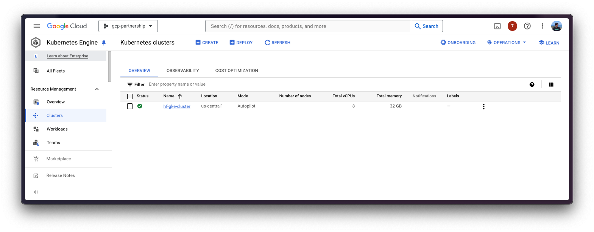
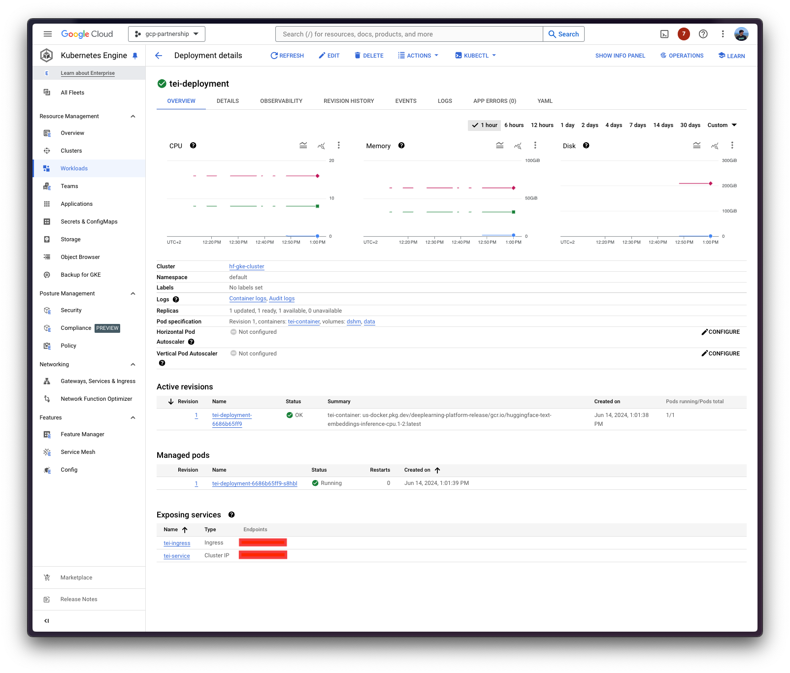

# Deploy Snowflake's Arctic Embed (M) with Text Embeddings Inference (TEI) on GKE

Snowflake's Arctic Embed is a suite of text embedding models that focuses on creating high-quality retrieval models optimized for performance, achieving state-of-the-art (SOTA) performance on the MTEB/BEIR leaderboard for each of their size variants. Text Embeddings Inference (TEI) is a toolkit developed by Hugging Face for deploying and serving open source text embeddings and sequence classification models; enabling high-performance extraction for the most popular models, including FlagEmbedding, Ember, GTE and E5. And, Google Kubernetes Engine (GKE) is a fully-managed Kubernetes service in Google Cloud that can be used to deploy and operate containerized applications at scale using GCP's infrastructure. This post explains how to deploy a text embedding model from the Hugging Face Hub on a GKE Cluster running a purpose-built container to deploy text embedding models in a secure and managed environment with the Hugging Face DLC for TEI.

## Setup / Configuration

First, you need to install both `gcloud` and `kubectl` in your local machine, which are the command-line tools for Google Cloud and Kubernetes, respectively, to interact with the GCP and the GKE Cluster.

* To install `gcloud`, follow the instructions at [Cloud SDK Documentation - Install the gcloud CLI](https://cloud.google.com/sdk/docs/install).
* To install `kubectl`, follow the instructions at [Kubernetes Documentation - Install Tools](https://kubernetes.io/docs/tasks/tools/#kubectl).

Optionally, to ease the usage of the commands within this tutorial, you need to set the following environment variables for GCP:

```bash
export PROJECT_ID=your-project-id
export LOCATION=your-location
export CLUSTER_NAME=your-cluster-name
```

Then you need to login into your GCP account and set the project ID to the one you want to use for the deployment of the GKE Cluster.

```bash
gcloud auth login
gcloud config set project $PROJECT_ID
```

Once you are logged in, you need to enable the necessary service APIs in GCP, such as the Google Kubernetes Engine API, the Google Container Registry API, and the Google Container File System API, which are necessary for the deployment of the GKE Cluster and the Hugging Face DLC for TEI.

```bash
gcloud services enable container.googleapis.com
gcloud services enable containerregistry.googleapis.com
gcloud services enable containerfilesystem.googleapis.com
```

Additionally, to use `kubectl` with the GKE Cluster credentials, you also need to install the `gke-gcloud-auth-plugin`, that can be installed with `gcloud` as follows:

```bash
gcloud components install gke-gcloud-auth-plugin
```

> [!NOTE]
> Installing the `gke-gcloud-auth-plugin` does not need to be installed via `gcloud` specifically, to read more about the alternative installation methods, please visit <https://cloud.google.com/kubernetes-engine/docs/how-to/cluster-access-for-kubectl#install_plugin>.

## Create GKE Cluster

Once everything is set up, you can proceed with the creation of the GKE Cluster and the node pool, which in this case will be a single CPU node as for most of the workloads CPU inference is enough to serve most of the text embeddings models, while it could benefit a lot from GPU serving.

> [!NOTE]
> CPU is being used to run the inference on top of the text embeddings models to showcase the current capabilities of TEI, but switching to GPU is as easy as replacing `spec.containers[0].image` with `us-docker.pkg.dev/deeplearning-platform-release/gcr.io/huggingface-text-embeddings-inference-cu122.1-2.ubuntu2204`, and then updating the requested resources, as well as the `nodeSelector` requirements in the `deployment.yaml` file. For more information, please refer to the [`gpu-config`](./gpu-config/) directory that contains a pre-defined configuration for GPU serving in TEI with an NVIDIA Tesla T4 GPU (with a compute capability of 7.5 i.e. natively supported in TEI).

To deploy the GKE Cluster, the "Autopilot" mode will be used as it is the recommended one for most of the workloads, since the underlying infrastructure is managed by Google. Alternatively, you can also use the "Standard" mode.

> [!NOTE]
> Important to check before creating the GKE Autopilot Cluster the [GKE Documentation - Optimize Autopilot Pod performance by choosing a machine series](https://cloud.google.com/kubernetes-engine/docs/how-to/performance-pods), since not all the cluster versions support every CPU. Same applies for the GPU support e.g. `nvidia-l4` is not supported in the GKE cluster versions 1.28.3 or lower.

```bash
gcloud container clusters create-auto $CLUSTER_NAME \
    --project=$PROJECT_ID \
    --location=$LOCATION \
    --release-channel=stable \
    --cluster-version=1.28
```

> [!NOTE]
> To select the specific version in your location of the GKE Cluster, you can run the following command:
>
> ```bash
> gcloud container get-server-config \
>     --flatten="channels" \
>     --filter="channels.channel=STABLE" \
>     --format="yaml(channels.channel,channels.defaultVersion)" \
>     --location=$LOCATION
> ```
>
> For more information please visit <https://cloud.google.com/kubernetes-engine/versioning#specifying_cluster_version>.



Once the GKE Cluster is created, you can get the credentials to access it via `kubectl` with the following command:

```bash
gcloud container clusters get-credentials $CLUSTER_NAME --location=$LOCATION
```

## Deploy TEI

Now you can proceed to the Kubernetes deployment of the Hugging Face DLC for TEI, serving the [`Snowflake/snowflake-arctic-embed-m`](https://huggingface.co/Snowflake/snowflake-arctic-embed-m) model from the Hugging Face Hub.

> [!NOTE]
> Recently, the Hugging Face Hub team has included the `text-embeddings-inference` tag in the Hub, so feel free to explore all the embedding models in the Hub that can be served via TEI at <https://huggingface.co/models?other=text-embeddings-inference>.

The Hugging Face DLC for TEI will be deployed via `kubectl`, from the configuration files in either the `cpu-config/` or the `gpu-config/` directories depending on whether you want to use the CPU or GPU accelerators, respectively:

* `deployment.yaml`: contains the deployment details of the pod including the reference to the Hugging Face DLC for TEI setting the `MODEL_ID` to [`Snowflake/snowflake-arctic-embed-m`](https://huggingface.co/Snowflake/snowflake-arctic-embed-m).
* `service.yaml`: contains the service details of the pod, exposing the port 80 for the TEI service.
* (optional) `ingress.yaml`: contains the ingress details of the pod, exposing the service to the external world so that it can be accessed via the ingress IP.

```bash
kubectl apply -f cpu-config/
```

> [!NOTE]
> As already mentioned, for this example you will be deploying the container in a CPU node, but the configuration to deploy TEI in a GPU node is also available in the [`gpu-config`](./gpu-config/) directory, so if you want to deploy TEI in a GPU node, please run `kubectl apply -f gpu-config/` instead of `kubectl apply -f cpu-config/`.



> [!NOTE]
> The Kubernetes deployment may take a few minutes to be ready, so you can check the status of the deployment with the following command:
>
> ```bash
> kubectl get pods
> ```
>
> Alternatively, you can just wait for the deployment to be ready with the following command:
>
> ```bash
> kubectl wait --for=condition=Available --timeout=700s deployment/tei-deployment
> ```

## Inference with TEI

To run the inference over the deployed TEI service, you can either:

* Port-forwarding the deployed TEI service to the port 8080, so as to access via `localhost` with the command:

    ```bash
    kubectl port-forward service/tei-service 8080:8080
    ```

* Accessing the TEI service via the external IP of the ingress, which is the default scenario here since you have defined the ingress configuration in the `cpu-config/ingress.yaml` or the `gpu-config/ingress.yaml` file (but it can be skipped in favour of the port-forwarding), that can be retrieved with the following command:

    ```bash
    kubectl get ingress tei-ingress -o jsonpath='{.status.loadBalancer.ingress[0].ip}'
    ```

> [!NOTE]
> TEI exposes different inference endpoints based on the task that the model is serving:
>
> * **Text Embeddings**: text embedding models expose the endpoint `/embed` expecting a payload with the key `inputs` which is either a string or a list of strings to be embedded.
> * **Re-rank**: re-ranker models expose the endpoint `/rerank` expecting a payload with the keys `query` and `texts`, where the `query` is the reference used to rank the similarity against each text in `texts`.
> * **Sequence Classification**: classic sequence classification models expose the endpoint `/predict` which expects a payload with the key `inputs` which is either a string or a list of strings to classify.
> More information at <https://huggingface.co/docs/text-embeddings-inference/quick_tour>.

### Via cURL

To send a POST request to the TEI service using `cURL`, you can run the following command:

```bash
curl http://localhost:8080/embed \
    -X POST \
    -d '{"inputs":"What is Deep Learning?"}' \
    -H 'Content-Type: application/json'
```

Or to send the POST request to the ingress IP:

```bash
curl http://$(kubectl get ingress tei-ingress -o jsonpath='{.status.loadBalancer.ingress[0].ip}')/embed \
    -X POST \
    -d '{"inputs":"What is Deep Learning?"}' \
    -H 'Content-Type: application/json'
```

Which produces the following output (truncated for brevity, but original tensor length is 768, which is the embedding dimension of [`Snowflake/snowflake-arctic-embed-m`](https://huggingface.co/Snowflake/snowflake-arctic-embed-m) i.e. the model you are serving):

```bash
[[-0.01483098,0.010846359,-0.024679236,0.012507628,0.034231555,...]]
```

## Delete GKE Cluster

Finally, once you are done using TEI in the GKE Cluster, you can safely delete the GKE Cluster to avoid incurring in unnecessary costs.

```bash
gcloud container clusters delete $CLUSTER_NAME --location=$LOCATION
```

Alternatively, you can also downscale the replicas of the deployed pod to 0 in case you want to preserve the cluster, since the default GKE Cluster deployed with GKE Autopilot mode is running just a single `e2-small` instance.

```bash
kubectl scale --replicas=0 deployment/tei-deployment
```
