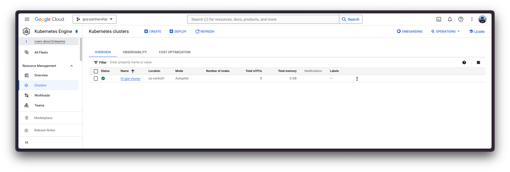
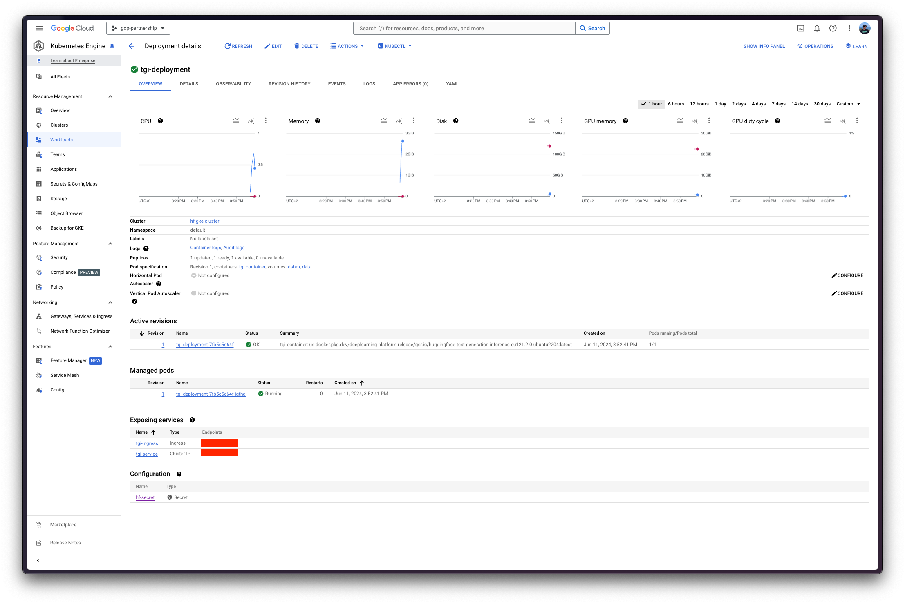

# Deploy Meta Llama 3 8B with Text Generation Inference (TGI) on GKE

Meta Llama 3 is the latest LLM from the Llama family, released by Meta; coming in two sizes 8B and 70B, including both the base model and the instruction-tuned model. Text Generation Inference (TGI) is a toolkit developed by Hugging Face for deploying and serving LLMs, with high performance text generation. And, Google Kubernetes Engine (GKE) is a fully-managed Kubernetes service in Google Cloud that can be used to deploy and operate containerized applications at scale using GCP's infrastructure.

This example showcases how to deploy an LLM from the Hugging Face Hub, as Llama3 8B Instruct, on a GKE Cluster running a purpose-built container to deploy LLMs in a secure and managed environment with the Hugging Face DLC for TGI.

## Setup / Configuration

First, you need to install both `gcloud` and `kubectl` in your local machine, which are the command-line tools for Google Cloud and Kubernetes, respectively, to interact with the GCP and the GKE Cluster.

- To install `gcloud`, follow the instructions at [Cloud SDK Documentation - Install the gcloud CLI](https://cloud.google.com/sdk/docs/install).
- To install `kubectl`, follow the instructions at [Kubernetes Documentation - Install Tools](https://kubernetes.io/docs/tasks/tools/#kubectl).

Optionally, to ease the usage of the commands within this tutorial, you need to set the following environment variables for GCP:

```bash
export PROJECT_ID=your-project-id
export LOCATION=your-location
export CLUSTER_NAME=your-cluster-name
```

Then you need to login into your GCP account and set the project ID to the one you want to use for the deployment of the GKE Cluster.

```bash
gcloud auth login
gcloud auth application-default login  # For local development
gcloud config set project $PROJECT_ID
```

Once you are logged in, you need to enable the necessary service APIs in GCP, such as the Google Kubernetes Engine API, the Google Container Registry API, and the Google Container File System API, which are necessary for the deployment of the GKE Cluster and the Hugging Face DLC for TGI.

```bash
gcloud services enable container.googleapis.com
gcloud services enable containerregistry.googleapis.com
gcloud services enable containerfilesystem.googleapis.com
```

Additionally, to use `kubectl` with the GKE Cluster credentials, you also need to install the `gke-gcloud-auth-plugin`, that can be installed with `gcloud` as follows:

```bash
gcloud components install gke-gcloud-auth-plugin
```

> [!NOTE]
> Installing the `gke-gcloud-auth-plugin` does not need to be installed via `gcloud` specifically, to read more about the alternative installation methods, please visit <https://cloud.google.com/kubernetes-engine/docs/how-to/cluster-access-for-kubectl#install_plugin>.

## Create GKE Cluster

Once everything's set up, you can proceed with the creation of the GKE Cluster and the node pool, which in this case will be a single GPU node, in order to use the GPU accelerator for high performance inference, also following TGI recommendations based on their internal optimizations for GPUs.

To deploy the GKE Cluster, the "Autopilot" mode will be used as it is the recommended one for most of the workloads, since the underlying infrastructure is managed by Google. Alternatively, you can also use the "Standard" mode.

> [!NOTE]
> Important to check before creating the GKE Autopilot Cluster the [GKE Documentation - Optimize Autopilot Pod performance by choosing a machine series](https://cloud.google.com/kubernetes-engine/docs/how-to/performance-pods), since not all the versions support GPU accelerators e.g. `nvidia-l4` is not supported in the GKE cluster versions 1.28.3 or lower.

```bash
gcloud container clusters create-auto $CLUSTER_NAME \
    --project=$PROJECT_ID \
    --location=$LOCATION \
    --release-channel=stable \
    --cluster-version=1.28 \
    --no-autoprovisioning-enable-insecure-kubelet-readonly-port
```

> [!NOTE]
> To select the specific version in your location of the GKE Cluster, you can run the following command:
>
> ```bash
> gcloud container get-server-config \
>     --flatten="channels" \
>     --filter="channels.channel=STABLE" \
>     --format="yaml(channels.channel,channels.defaultVersion)" \
>     --location=$LOCATION
> ```
>
> For more information please visit <https://cloud.google.com/kubernetes-engine/versioning#specifying_cluster_version>.



Once the GKE Cluster is created, you can get the credentials to access it via `kubectl` with the following command:

```bash
gcloud container clusters get-credentials $CLUSTER_NAME --location=$LOCATION
```

## Optional: Set Secrets in GKE

As [`meta-llama/Meta-Llama-3.1-8B-Instruct`](https://huggingface.co/meta-llama/Meta-Llama-3.1-8B-Instruct) is a gated model, you need to set a Kubernetes secret with the Hugging Face Hub token via `kubectl`.

To generate a custom token for the Hugging Face Hub, you can follow the instructions at <https://huggingface.co/docs/hub/en/security-tokens>; and the recommended way of setting it is to install the `huggingface_hub` Python SDK as follows:

```bash
pip install --upgrade --quiet huggingface_hub
```

And then login in with the generated token with read-access over the gated/private model:

```bash
huggingface-cli login
```

Finally, you can create the Kubernetes secret with the generated token for the Hugging Face Hub as follows using the `huggingface_hub` Python SDK to retrieve the token:

```bash
kubectl create secret generic hf-secret \
    --from-literal=hf_token=$(python -c "from huggingface_hub import get_token; print(get_token())") \
    --dry-run=client -o yaml | kubectl apply -f -
```

Or, alternatively, you can directly set the token as follows:

```bash
kubectl create secret generic hf-secret \
    --from-literal=hf_token=hf_*** \
    --dry-run=client -o yaml | kubectl apply -f -
```


More information on how to set Kubernetes secrets in a GKE Cluster at <https://cloud.google.com/secret-manager/docs/secret-manager-managed-csi-component>.

## Deploy TGI

Now you can proceed to the Kubernetes deployment of the Hugging Face DLC for TGI, serving the [`meta-llama/Meta-Llama-3.1-8B-Instruct`](https://huggingface.co/meta-llama/Meta-Llama-3.1-8B-Instruct) model from the Hugging Face Hub.

> [!NOTE]
> To explore all the models that can be served via TGI, you can explore the models tagged with `text-generation-inference` in the Hub at <https://huggingface.co/models?other=text-generation-inference>.

The Hugging Face DLC for TGI will be deployed via `kubectl`, from the configuration files in the `config/` directory:

- `deployment.yaml`: contains the deployment details of the pod including the reference to the Hugging Face DLC for TGI setting the `MODEL_ID` to [`meta-llama/Meta-Llama-3.1-8B-Instruct`](https://huggingface.co/meta-llama/Meta-Llama-3.1-8B-Instruct).

- `service.yaml`: contains the service details of the pod, exposing the port 80 for the TGI service.
- (optional) `ingress.yaml`: contains the ingress details of the pod, exposing the service to the external world so that it can be accessed via the ingress IP.

```bash
kubectl apply -f config/
```



> [!NOTE]
> The Kubernetes deployment may take a few minutes to be ready, so you can check the status of the deployment with the following command:
>
> ```bash
> kubectl get pods
> ```
>
> Alternatively, you can just wait for the deployment to be ready with the following command:
>
> ```bash
> kubectl wait --for=condition=Available --timeout=700s deployment/tei-deployment
> ```

## Inference with TGI

To run the inference over the deployed TGI service, you can either:

- Port-forwarding the deployed TGI service to the port 8080, so as to access via `localhost` with the command:

  ```bash
  kubectl port-forward service/tgi-service 8080:8080
  ```

- Accessing the TGI service via the external IP of the ingress, which is the default scenario here since you have defined the ingress configuration in the `config/ingress.yaml` file (but it can be skipped in favour of the port-forwarding), that can be retrieved with the following command:

  ```bash
  kubectl get ingress tgi-ingress -o jsonpath='{.status.loadBalancer.ingress[0].ip}'
  ```

### Via cURL

To send a POST request to the TGI service using `cURL`, you can run the following command:

```bash
curl http://localhost:8080/generate \
    -X POST \
    -d '{"inputs":"<|begin_of_text|><|start_header_id|>system<|end_header_id|>\n\nYou are a helpful assistant.<|eot_id|><|start_header_id|>user<|end_header_id|>\n\nWhat is 2+2?<|eot_id|><|start_header_id|>assistant<|end_header_id|>\n\n","parameters":{"temperature":0.7, "top_p": 0.95, "max_new_tokens": 128}}' \
    -H 'Content-Type: application/json'
```

Or send a POST request to the ingress IP instead:

```bash
curl http://$(kubectl get ingress tgi-ingress -o jsonpath='{.status.loadBalancer.ingress[0].ip}')/generate \
    -X POST \
    -d '{"inputs":"<|begin_of_text|><|start_header_id|>system<|end_header_id|>\n\nYou are a helpful assistant.<|eot_id|><|start_header_id|>user<|end_header_id|>\n\nWhat is 2+2?<|eot_id|><|start_header_id|>assistant<|end_header_id|>\n\n","parameters":{"temperature":0.7, "top_p": 0.95, "max_new_tokens": 128}}' \
    -H 'Content-Type: application/json'
```

Which produces the following output:

```
{"generated_text":"The answer to 2+2 is 4."}
```

> [!NOTE]
> To generate the `inputs` with the expected chat template formatting, you could use the following snippet:
>
> ```python
> from transformers import AutoTokenizer
> tokenizer = AutoTokenizer.from_pretrained("meta-llama/Meta-Llama-3-8B-Instruct")
> tokenizer.apply_chat_template(
>     [
>         {"role": "system", "content": "You are a helpful assistant."},
>         {"role": "user", "content": "What is 2+2?"},
>     ],
>     tokenize=False,
>     add_generation_prompt=True,
> )
> ```

### Via Python

To run the inference using Python, you can use the `openai` Python SDK (see the installation notes at <https://platform.openai.com/docs/quickstart>), setting either the localhost or the ingress IP as the `base_url` for the client, and then running the following code:

```python
from huggingface_hub import get_token
from openai import OpenAI

client = OpenAI(
    base_url="http://localhost:8080/v1/",
    api_key=get_token() or "-",
)

chat_completion = client.chat.completions.create(
    model="tgi",
    messages=[
        {"role": "system", "content": "You are a helpful assistant."},
        {"role": "user", "content": "What is 2+2?"},
    ],
    max_tokens=128,
)
```

Which produces the following output:

```
ChatCompletion(id='', choices=[Choice(finish_reason='eos_token', index=0, logprobs=None, message=ChatCompletionMessage(content='The answer to 2+2 is 4!', role='assistant', function_call=None, tool_calls=None))], created=1718108522, model='meta-llama/Meta-Llama-3-8B-Instruct', object='text_completion', system_fingerprint='2.0.2-sha-6073ece', usage=CompletionUsage(completion_tokens=12, prompt_tokens=28, total_tokens=40))
```

## Delete GKE Cluster

Finally, once you are done using TGI on the GKE Cluster, you can safely delete the GKE Cluster to avoid incurring in unnecessary costs.

```bash
gcloud container clusters delete $CLUSTER_NAME --location=$LOCATION
```

Alternatively, you can also downscale the replicas of the deployed pod to 0 in case you want to preserve the cluster, since the default GKE Cluster deployed with GKE Autopilot mode is running just a single `e2-small` instance.

```bash
kubectl scale --replicas=0 deployment/tgi-deployment
```
