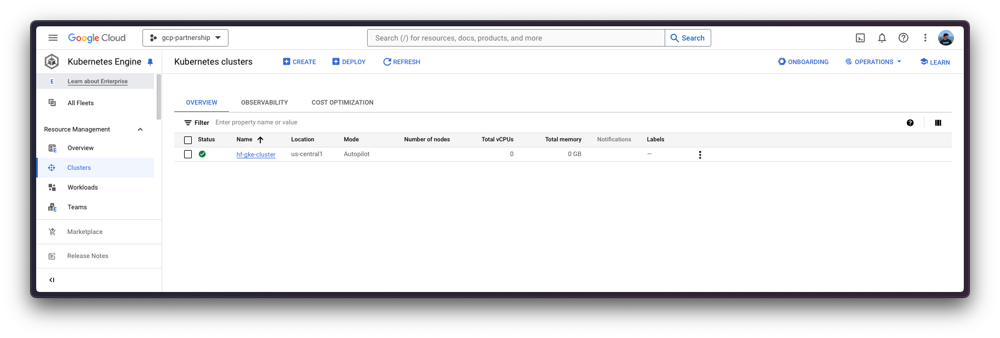
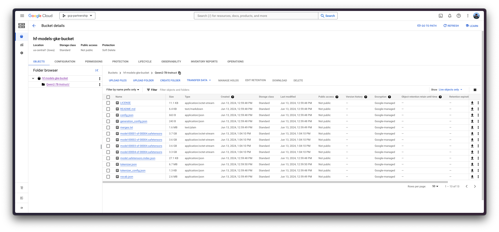
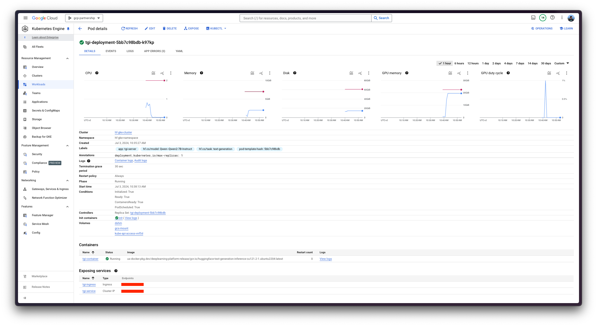

# Deploy Qwen2 7B with TGI DLC from GCS on GKE

Qwen2 is the new series of Qwen Large Language Models (LLMs) built by Alibaba Cloud, with both base and instruction-tuned language models ranging from 0.5 to 72 billion parameters, including a Mixture-of-Experts model; the 7B variant sitting in the second place in the 7B size range in the Open LLM Leaderboard by Hugging Face and the 72B one in the first place amongst any size. Text Generation Inference (TGI) is a toolkit developed by Hugging Face for deploying and serving LLMs, with high performance text generation. And, Google Kubernetes Engine (GKE) is a fully-managed Kubernetes service in Google Cloud that can be used to deploy and operate containerized applications at scale using GCP's infrastructure.

This example showcases how to deploy an LLM from a Google Cloud Storage (GCS) Bucket on a GKE Cluster running a purpose-built container to deploy LLMs in a secure and managed environment with the Hugging Face DLC for TGI.

## Setup / Configuration

First, you need to install both `gcloud` and `kubectl` in your local machine, which are the command-line tools for Google Cloud and Kubernetes, respectively, to interact with the GCP and the GKE Cluster.

- To install `gcloud`, follow the instructions at [Cloud SDK Documentation - Install the gcloud CLI](https://cloud.google.com/sdk/docs/install).
- To install `kubectl`, follow the instructions at [Kubernetes Documentation - Install Tools](https://kubernetes.io/docs/tasks/tools/#kubectl).

Optionally, to ease the usage of the commands within this tutorial, you need to set the following environment variables for GCP:

```bash
export PROJECT_ID=your-project-id
export LOCATION=your-location
export CLUSTER_NAME=your-cluster-name
export BUCKET_NAME=your-bucket-name
```

Then you need to login into your GCP account and set the project ID to the one you want to use for the deployment of the GKE Cluster.

```bash
gcloud auth login
gcloud auth application-default login  # For local development
gcloud config set project $PROJECT_ID
```

Once you are logged in, you need to enable the necessary service APIs in GCP, such as the Google Kubernetes Engine API, the Google Container Registry API, and the Google Container File System API, which are necessary for the deployment of the GKE Cluster and the Hugging Face DLC for TGI.

```bash
gcloud services enable container.googleapis.com
gcloud services enable containerregistry.googleapis.com
gcloud services enable containerfilesystem.googleapis.com
```

Additionally, to use `kubectl` with the GKE Cluster credentials, you also need to install the `gke-gcloud-auth-plugin`, that can be installed with `gcloud` as follows:

```bash
gcloud components install gke-gcloud-auth-plugin
```

> [!NOTE]
> Installing the `gke-gcloud-auth-plugin` does not need to be installed via `gcloud` specifically, to read more about the alternative installation methods, please visit <https://cloud.google.com/kubernetes-engine/docs/how-to/cluster-access-for-kubectl#install_plugin>.

## Create GKE Cluster

Once everything is set up, you can proceed with the creation of the GKE Cluster and the node pool, which in this case will be a single GPU node, in order to use the GPU accelerator for high performance inference, also following TGI recommendations based on their internal optimizations for GPUs.

To deploy the GKE Cluster, the "Autopilot" mode will be used as it is the recommended one for most of the workloads, since the underlying infrastructure is managed by Google. Alternatively, you can also use the "Standard" mode.

> [!NOTE]
> Important to check before creating the GKE Autopilot Cluster the [GKE Documentation - Optimize Autopilot Pod performance by choosing a machine series](https://cloud.google.com/kubernetes-engine/docs/how-to/performance-pods), since not all the versions support GPU accelerators e.g. `nvidia-l4` is not supported in the GKE cluster versions 1.28.3 or lower.

```bash
gcloud container clusters create-auto $CLUSTER_NAME \
    --project=$PROJECT_ID \
    --location=$LOCATION \
    --release-channel=stable \
    --cluster-version=1.28 \
    --no-autoprovisioning-enable-insecure-kubelet-readonly-port
```

> [!NOTE]
> To select the specific version in your location of the GKE Cluster, you can run the following command:
>
> ```bash
> gcloud container get-server-config \
>     --flatten="channels" \
>     --filter="channels.channel=STABLE" \
>     --format="yaml(channels.channel,channels.defaultVersion)" \
>     --location=$LOCATION
> ```
>
> For more information please visit <https://cloud.google.com/kubernetes-engine/versioning#specifying_cluster_version>.



Once the GKE Cluster is created, you can get the credentials to access it via `kubectl` with the following command:

```bash
gcloud container clusters get-credentials $CLUSTER_NAME --location=$LOCATION
```

## Optional: Upload a model from the Hugging Face Hub to GCS

This is an optional step in the tutorial, since you may want to reuse an existing model on a GCS Bucket, if that is the case, then feel free to jump to the next step of the tutorial on how to configure the IAM for GCS so that you can access the bucket from a pod in the GKE Cluster.

Otherwise, to upload a model from the Hugging Face Hub to a GCS Bucket, you can use the script [scripts/upload_model_to_gcs.sh](https://github.com/huggingface/Google-Cloud-Containers/blob/main/scripts/upload_model_to_gcs.sh), which will download the model from the Hugging Face Hub and upload it to the GCS Bucket (and create the bucket if not created already).

The `gsutil` component should be installed via `gcloud`, and the Python packages `huggingface_hub` with the extra `hf_transfer`, and the package `crcmod` should also be installed.

```bash
gcloud components install gsutil
pip install --upgrade --quiet "huggingface_hub[hf_transfer]" crcmod
```

Then, you can run the script to download the model from the Hugging Face Hub and then upload it to the GCS Bucket:

> [!NOTE]
> Make sure to set the proper permissions to run the script i.e. `chmod +x scripts/upload_model_to_gcs.sh`.

```bash
./scripts/upload_model_to_gcs.sh --model-id Qwen/Qwen2-7B-Instruct --gcs gs://$BUCKET_NAME/Qwen2-7B-Instruct
```



## Configure IAM for GCS

Before you proceed with the deployment of the Hugging Face DLC for TGI on the GKE Cluster, you need to set the IAM permissions for the GCS Bucket so that the pod in the GKE Cluster can access the bucket. To do so, you need to create a namespace and a service account in the GKE Cluster, and then set the IAM permissions for the GCS Bucket that contains the model, either as uploaded from the Hugging Face Hub or as already existing in the GCS Bucket.

For convenience, as the reference to both the namespace and the service account will be used within the following steps, the environment variables `NAMESPACE` and `SERVICE_ACCOUNT` will be set.

```bash
export NAMESPACE=hf-gke-namespace
export SERVICE_ACCOUNT=hf-gke-service-account
```

Then you can create the namespace and the service account in the GKE Cluster, enabling the creation of the IAM permissions for the pods in that namespace to access the GCS Bucket when using that service account.

```bash
kubectl create namespace $NAMESPACE
kubectl create serviceaccount $SERVICE_ACCOUNT --namespace $NAMESPACE
```

Then you need to add the IAM policy binding to the bucket as follows:

```bash
gcloud storage buckets add-iam-policy-binding \
    gs://$BUCKET_NAME \
    --member "principal://iam.googleapis.com/projects/$(gcloud projects describe $PROJECT_ID --format="value(projectNumber)")/locations/global/workloadIdentityPools/$PROJECT_ID.svc.id.goog/subject/ns/$NAMESPACE/sa/$SERVICE_ACCOUNT" \
    --role "roles/storage.objectUser"
```

## Deploy TGI

Now you can proceed to the Kubernetes deployment of the Hugging Face DLC for TGI, serving the [`Qwen/Qwen2-7B-Instruct`](https://huggingface.co/Qwen/Qwen2-7B-Instruct) model, from a volume mounted in `/data`, copied from the GCS Bucket where the model is located.

> [!NOTE]
> To explore all the models that can be served via TGI, you can explore the models tagged with `text-generation-inference` in the Hub at <https://huggingface.co/models?other=text-generation-inference>.

The Hugging Face DLC for TGI will be deployed via `kubectl`, from the configuration files in the [`config/`](./config/) directory:

- [`deployment.yaml`](./config/deployment.yaml): contains the deployment details of the pod including the reference to the Hugging Face DLC for TGI setting the `MODEL_ID` to the model path in the volume mount, in this case `/data/Qwen2-7B-Instruct`.
- [`service.yaml`](./config/service.yaml): contains the service details of the pod, exposing the port 8080 for the TGI service.
- [`storageclass.yaml`](./config/storageclass.yaml): contains the storage class details of the pod, defining the storage class for the volume mount.
- (optional) [`ingress.yaml`](./config/ingress.yaml): contains the ingress details of the pod, exposing the service to the external world so that it can be accessed via the ingress IP.

```bash
kubectl apply -f config/
```



> [!NOTE]
> The Kubernetes deployment may take a few minutes to be ready, so you can check the status of the deployment with the following command:
>
> ```bash
> kubectl get pods --namespace $NAMESPACE
> ```
>
> Alternatively, you can just wait for the deployment to be ready with the following command:
>
> ```bash
> kubectl wait --for=condition=Available --timeout=700s --namespace $NAMESPACE deployment/tgi-deployment
> ```

## Inference with TGI

To run the inference over the deployed TGI service, you can either:

- Port-forwarding the deployed TGI service to the port 8080, so as to access via `localhost` with the command:

  ```bash
  kubectl port-forward --namespace $NAMESPACE service/tgi-service 8080:8080
  ```

- Accessing the TGI service via the external IP of the ingress, which is the default scenario here since you have defined the ingress configuration in the `config/ingress.yaml` file (but it can be skipped in favour of the port-forwarding), that can be retrieved with the following command:

  ```bash
  kubectl get ingress --namespace $NAMESPACE tgi-ingress -o jsonpath='{.status.loadBalancer.ingress[0].ip}'
  ```

### Via cURL

To send a POST request to the TGI service using `cURL`, you can run the following command:

```bash
curl http://localhost:8080/generate \
    -X POST \
    -d '{"inputs":"<|im_start|>system\nYou are a helpful assistant.<|im_end|>\n<|im_start|>user\nWhat is 2+2?<|im_end|>\n<|im_start|>assistant\n","parameters":{"temperature":0.7, "top_p": 0.95, "max_new_tokens": 128}}' \
    -H 'Content-Type: application/json'
```

Or send a POST request to the ingress IP instead:

```bash
curl http://$(kubectl get ingress --namespace $NAMESPACE tgi-ingress -o jsonpath='{.status.loadBalancer.ingress[0].ip}')/generate \
    -X POST \
    -d '{"inputs":"<|im_start|>system\nYou are a helpful assistant.<|im_end|>\n<|im_start|>user\nWhat is 2+2?<|im_end|>\n<|im_start|>assistant\n","parameters":{"temperature":0.7, "top_p": 0.95, "max_new_tokens": 128}}' \
    -H 'Content-Type: application/json'
```

Which produces the following output:

```
{"generated_text":"2 + 2 equals 4."}
```

> [!NOTE]
> To generate the `inputs` with the expected chat template formatting, you could use the following snippet:
>
> ```python
> from transformers import AutoTokenizer
> tokenizer = AutoTokenizer.from_pretrained("Qwen/Qwen2-7B-Instruct")
> tokenizer.apply_chat_template(
>     [
>         {"role": "system", "content": "You are a helpful assistant."},
>         {"role": "user", "content": "What is 2+2?"},
>     ],
>     tokenize=False,
>     add_generation_prompt=True,
> )
> ```

### Via Python

To run the inference using Python, you can use the `openai` Python SDK (see the installation notes at <https://platform.openai.com/docs/quickstart>), setting either the localhost or the ingress IP as the `base_url` for the client, and then running the following code:

```python
from huggingface_hub import get_token
from openai import OpenAI

client = OpenAI(
    base_url="http://localhost:8080/v1/",
    api_key=get_token() or "-",
)

chat_completion = client.chat.completions.create(
    model="tgi",
    messages=[
        {"role": "system", "content": "You are a helpful assistant."},
        {"role": "user", "content": "What is 2+2?"},
    ],
    max_tokens=128,
)
```

Which produces the following output:

```
ChatCompletion(id='', choices=[Choice(finish_reason='eos_token', index=0, message=ChatCompletionMessage(content='2 + 2 equals 4.', role='assistant', function_call=None, tool_calls=None), logprobs=None)], created=1719996359, model='/data/Qwen2-7B-Instruct', object='chat.completion', system_fingerprint='2.1.0-native', usage=CompletionUsage(completion_tokens=9, prompt_tokens=26, total_tokens=35))
```

## Delete GKE Cluster

Finally, once you are done using TGI on the GKE Cluster, you can safely delete the GKE Cluster to avoid incurring in unnecessary costs.

```bash
gcloud container clusters delete $CLUSTER_NAME --location=$LOCATION
```

Alternatively, you can also downscale the replicas of the deployed pod to 0 in case you want to preserve the cluster, since the default GKE Cluster deployed with GKE Autopilot mode is running just a single `e2-small` instance.

```bash
kubectl scale --replicas=0 --namespace $NAMESPACE deployment/tgi-deployment
```
