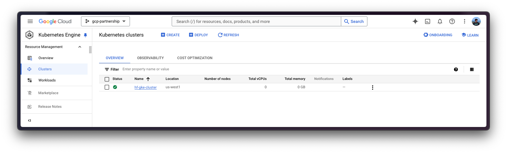
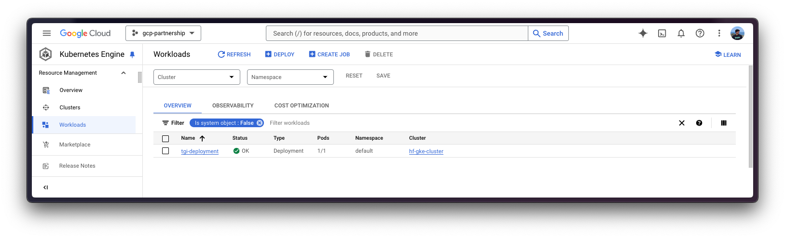
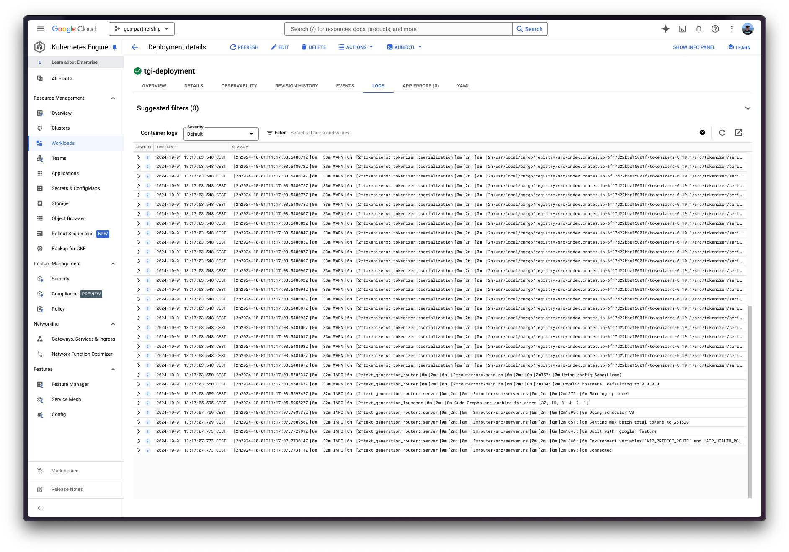

# Deploy Llama 3.1 405B with TGI DLC on GKE

[Llama 3.1](https://huggingface.co/blog/llama31) is one of the latest LLMs from the Llama family released by Meta (latest is Llama 3.2 as of October 2024); three sizes: 8B for efficient deployment and development on consumer-size GPU, 70B for large-scale AI native applications, and 405B for synthetic data, LLM as a Judge or distillation; among other use cases; whilst the 405B variant being one of the biggest open LLMs. Text Generation Inference (TGI) is a toolkit developed by Hugging Face for deploying and serving LLMs, with high performance text generation. And, Google Kubernetes Engine (GKE) is a fully-managed Kubernetes service in Google Cloud that can be used to deploy and operate containerized applications at scale using Google infrastructure.

This example showcases how to deploy [`meta-llama/Llama-3.1-405B-Instruct-FP8`](https://hf.co/meta-llama/Llama-3.1-405B-Instruct-FP8) on a GKE Cluster on a node with 8 NVIDIA H100s via the Hugging Face purpose-built Deep Learning Container (DLC) for Text Generation Inference (TGI) on Google Cloud.

## Setup / Configuration

First, you need to install both `gcloud` and `kubectl` in your local machine, which are the command-line tools for Google Cloud and Kubernetes, respectively, to interact with the GCP and the GKE Cluster.

- To install `gcloud`, follow the instructions at [Cloud SDK Documentation - Install the gcloud CLI](https://cloud.google.com/sdk/docs/install).
- To install `kubectl`, follow the instructions at [Kubernetes Documentation - Install Tools](https://kubernetes.io/docs/tasks/tools/#kubectl).

Optionally, to ease the usage of the commands within this tutorial, you need to set the following environment variables for GCP:

```bash
export PROJECT_ID=your-project-id
export LOCATION=your-location
export CLUSTER_NAME=your-cluster-name
```

Then you need to login into your GCP account and set the project ID to the one you want to use for the deployment of the GKE Cluster.

```bash
gcloud auth login
gcloud auth application-default login  # For local development
gcloud config set project $PROJECT_ID
```

Once you are logged in, you need to enable the necessary service APIs in GCP, such as the Google Kubernetes Engine API, the Google Container Registry API, and the Google Container File System API, which are necessary for the deployment of the GKE Cluster and the Hugging Face DLC for TGI.

```bash
gcloud services enable container.googleapis.com
gcloud services enable containerregistry.googleapis.com
gcloud services enable containerfilesystem.googleapis.com
```

Additionally, to use `kubectl` with the GKE Cluster credentials, you also need to install the `gke-gcloud-auth-plugin`, that can be installed with `gcloud` as follows:

```bash
gcloud components install gke-gcloud-auth-plugin
```

> [!NOTE]
> Installing the `gke-gcloud-auth-plugin` does not need to be installed via `gcloud` specifically, to read more about the alternative installation methods, please visit [GKE Documentation - Install kubectl and configure cluster access](https://cloud.google.com/kubernetes-engine/docs/how-to/cluster-access-for-kubectl#install_plugin).

Finally, note that you most likely will need to request a quota increase in order to be able to access the A3 instance with 8 NVIDIA H100 GPUs, as those need a specific manual approval from Google Cloud. To do so you will need to go to [IAM Admin - Quotas](https://console.cloud.google.com/iam-admin/quotas) and apply the following filters:

- `Service: Compute Engine API`: as GKE relies on Compute Engine for the resource allocation.

- `Dimensions (e.g. location): region: $LOCATION`: replace the `$LOCATION` value with the location specified above, but note that not all the regions may have NVIDIA H100 GPUs available so check [Compute Engine Documentation - Available regions and zones](https://cloud.google.com/compute/docs/regions-zones#available).

- `gpu_family: NVIDIA_H100`: is the identified of the NVIDIA H100 GPUs on Google Cloud.

And then request a quota increase to 8 NVIDIA H100 GPUs in order to run [`meta-llama/Llama-3.1-405B-Instruct-FP8`](https://hf.co/meta-llama/Llama-3.1-405B-Instruct-FP8).

## Create GKE Cluster

Once everything's set up, you can proceed with the creation of the GKE Cluster and the node pool, which in this case will be a single GPU node, in order to use the GPU accelerator for high performance inference, also following TGI recommendations based on their internal optimizations for GPUs.

To deploy the GKE Cluster, the "Autopilot" mode will be used as it is the recommended one for most of the workloads, since the underlying infrastructure is managed by Google. Alternatively, you can also use the "Standard" mode.

> [!NOTE]
> Important to check before creating the GKE Autopilot Cluster the [GKE Documentation - Optimize Autopilot Pod performance by choosing a machine series](https://cloud.google.com/kubernetes-engine/docs/how-to/performance-pods), since not all the versions support GPU accelerators e.g. `nvidia-l4` is not supported in the GKE cluster versions 1.28.3 or lower.

```bash
gcloud container clusters create-auto $CLUSTER_NAME \
    --project=$PROJECT_ID \
    --location=$LOCATION \
    --release-channel=stable \
    --cluster-version=1.29 \
    --no-autoprovisioning-enable-insecure-kubelet-readonly-port
```

> [!NOTE]
> To select the specific version in your location of the GKE Cluster, you can run the following command:
>
> ```bash
> gcloud container get-server-config \
>     --flatten="channels" \
>     --filter="channels.channel=STABLE" \
>     --format="yaml(channels.channel,channels.defaultVersion)" \
>     --location=$LOCATION
> ```
>
> For more information please visit [GKE Documentation - Specifying cluster version](https://cloud.google.com/kubernetes-engine/versioning#specifying_cluster_version).



Once the GKE Cluster is created, you can get the credentials to access it via `kubectl` with the following command:

```bash
gcloud container clusters get-credentials $CLUSTER_NAME --location=$LOCATION
```

## Get Hugging Face token and set secrets in GKE

As [`meta-llama/Llama-3.1-405B-Instruct-FP8`](https://hf.co/meta-llama/Llama-3.1-405B-Instruct-FP8) is a gated model, you need to set a Kubernetes secret with the Hugging Face Hub token via `kubectl`.

To generate a custom token for the Hugging Face Hub, you can follow the instructions at [Hugging Face Hub - User access tokens](https://huggingface.co/docs/hub/en/security-tokens); and the recommended way of setting it is to install the `huggingface_hub` Python SDK as follows:

```bash
pip install --upgrade --quiet huggingface_hub
```

And then login in with the generated token with read-access over the gated/private model:

```bash
huggingface-cli login
```

Finally, you can create the Kubernetes secret with the generated token for the Hugging Face Hub as follows using the `huggingface_hub` Python SDK to retrieve the token:

```bash
kubectl create secret generic hf-secret \
    --from-literal=hf_token=$(python -c "from huggingface_hub import get_token; print(get_token())") \
    --dry-run=client -o yaml | kubectl apply -f -
```

Or, alternatively, you can directly set the token as follows:

```bash
kubectl create secret generic hf-secret \
    --from-literal=hf_token=hf_*** \
    --dry-run=client -o yaml | kubectl apply -f -
```


More information on how to set Kubernetes secrets in a GKE Cluster at [Secret Manager Documentation - Use Secret Manager add-on with Google Kubernetes Engine](https://cloud.google.com/secret-manager/docs/secret-manager-managed-csi-component).

## Deploy TGI

Now you can proceed to the Kubernetes deployment of the Hugging Face DLC for TGI, serving the [`meta-llama/Llama-3.1-405B-Instruct-FP8`](https://hf.co/meta-llama/Llama-3.1-405B-Instruct-FP8) model from the Hugging Face Hub.

> [!NOTE]
> To explore all the models that can be served via TGI, you can explore [the models tagged with `text-generation-inference` in the Hub](https://huggingface.co/models?other=text-generation-inference).

The Hugging Face DLC for TGI will be deployed via `kubectl`, from the configuration files in the [`config/`](./config/) directory:

- [`deployment.yaml`](./config/deployment.yaml): contains the deployment details of the pod including the reference to the Hugging Face DLC for TGI setting the `MODEL_ID` to [`meta-llama/Llama-3.1-405B-Instruct-FP8`](https://hf.co/meta-llama/Llama-3.1-405B-Instruct-FP8).
- [`service.yaml`](./config/service.yaml): contains the service details of the pod, exposing the port 8080 for the TGI service.
- (optional) [`ingress.yaml`](./config/ingress.yaml): contains the ingress details of the pod, exposing the service to the external world so that it can be accessed via the ingress IP.

```bash
kubectl apply -f config/
```

> [!NOTE]
> The Kubernetes deployment may take a few minutes to be ready, so you can check the status of the deployment with the following command:
>
> ```bash
> kubectl get pods
> ```
>
> Alternatively, you can just wait for the deployment to be ready with the following command:
>
> ```bash
> kubectl wait --for=condition=Available --timeout=700s deployment/tgi-deployment
> ```





## Inference with TGI

To run the inference over the deployed TGI service, you can either:

- Port-forwarding the deployed TGI service to the port 8080, so as to access via `localhost` with the command:

  ```bash
  kubectl port-forward service/tgi-service 8080:8080
  ```

- Accessing the TGI service via the external IP of the ingress, which is the default scenario here since you have defined the ingress configuration in the `config/ingress.yaml` file (but it can be skipped in favour of the port-forwarding), that can be retrieved with the following command:

  ```bash
  kubectl get ingress tgi-ingress -o jsonpath='{.status.loadBalancer.ingress[0].ip}'
  ```

### Via cURL

To send a POST request to the TGI service using `cURL`, you can run the following command:

```bash
curl http://localhost:8080/v1/chat/completions \
    -X POST \
    -d '{"messages":[{"role":"system","content": "You are a helpful assistant."},{"role":"user","content":"What'\''s Deep Learning?"}],"temperature":0.7,"top_p":0.95,"max_tokens":128}}' \
    -H 'Content-Type: application/json'
```

Or send a POST request to the ingress IP instead (without specifying the port as it's not needed):

```bash
curl http://$(kubectl get ingress tgi-ingress -o jsonpath='{.status.loadBalancer.ingress[0].ip}')/v1/chat/completions \
    -X POST \
    -d '{"messages":[{"role":"system","content":"You are a helpful assistant."},{"role":"user","content":"What'\''s Deep Learning?"}],"temperature":0.7,"top_p":0.95,"max_tokens":128}}' \
    -H 'Content-Type: application/json'
```

Which generates the following output:

```
{"object":"chat.completion","id":"","created":1727782287,"model":"meta-llama/Llama-3.1-405B-Instruct-FP8","system_fingerprint":"2.2.0-native","choices":[{"index":0,"message":{"role":"assistant","content":"Deep learning is a subset of machine learning, which is a field of artificial intelligence (AI) that enables computers to learn from data without being explicitly programmed. It's a type of neural network that's inspired by the structure and function of the human brain.\n\nIn traditional machine learning, computers are trained on data using algorithms that are designed to recognize patterns and make predictions. However, these algorithms are often limited in their ability to handle complex data, such as images, speech, and text.\n\nDeep learning, on the other hand, uses multiple layers of artificial neural networks to analyze data. Each layer processes the data in a different way, allowing the"},"logprobs":null,"finish_reason":"length"}],"usage":{"prompt_tokens":46,"completion_tokens":128,"total_tokens":174}}
```

### Via Python

To run the inference using Python, you can either use the [`huggingface_hub` Python SDK](https://github.com/huggingface/huggingface_hub) (recommended) or the [`openai` Python SDK](https://github.com/openai/openai-python).

> [!NOTE]
> In the examples below `localhost` will be used, but if you did deploy TGI with the ingress, feel free to use the ingress IP as mentioned above (without specifying the port).

#### `huggingface_hub`

You can install it via `pip` as `pip install --upgrade --quiet huggingface_hub`, and then run the following snippet to mimic the `cURL` commands above i.e. sending requests to the Messages API:

```python
from huggingface_hub import InferenceClient

client = InferenceClient(base_url="http://localhost:8080", api_key="-")

chat_completion = client.chat.completions.create(
    messages=[
        {"role": "system", "content": "You are a helpful assistant."},
        {"role": "user", "content": "What's Deep Learning?"},
    ],
    max_tokens=128,
)
```

Which generates the following output:

```
ChatCompletionOutput(choices=[ChatCompletionOutputComplete(finish_reason='length', index=0, message=ChatCompletionOutputMessage(role='assistant', content='Deep learning is a subset of machine learning that focuses on neural networks with many layers, typically more than two. These neural networks are designed to mimic the structure and function of the human brain, with each layer processing and transforming inputs in a hierarchical manner.\n\nIn traditional machine learning, models are trained using a set of predefined features, such as edges, textures, or shapes. In contrast, deep learning models learn to extract features from raw data automatically, without the need for manual feature engineering.\n\nDeep learning models are trained using large amounts of data and computational power, which enables them to learn complex patterns and relationships in the data. These models can be', tool_calls=None), logprobs=None)], created=1727782322, id='', model='meta-llama/Llama-3.1-405B-Instruct-FP8', system_fingerprint='2.2.0-native', usage=ChatCompletionOutputUsage(completion_tokens=128, prompt_tokens=46, total_tokens=174))
```

Alternatively, you can also format the prompt yourself and send that via the Text Generation API:

```python
from huggingface_hub import InferenceClient, get_token
from transformers import AutoTokenizer

tokenizer = AutoTokenizer.from_pretrained("meta-llama/Llama-3.1-405B-Instruct-FP8", token=get_token())
client = InferenceClient("http://localhost:8080", api_key="-")

generation = client.text_generation(
    prompt=tokenizer.apply_chat_template(
        [
            {"role": "system", "content": "You are a helpful assistant."},
            {"role": "user", "content": "What's Deep Learning?"},
        ],
        tokenize=False,
        add_generation_prompt=True,
    ),
    max_new_tokens=128,
)
```

Which generates the following output:

```
'Deep learning is a subset of machine learning that involves the use of artificial neural networks to analyze and interpret data. Inspired by the structure and function of the human brain, deep learning algorithms are designed to learn and improve on their own by automatically adjusting the connections between nodes or "neurons" in the network.\n\nIn traditional machine learning, algorithms are trained on a set of data and then use that training to make predictions or decisions on new, unseen data. However, these algorithms often rely on hand-engineered features and rules to extract relevant information from the data. In contrast, deep learning algorithms can automatically learn to extract relevant features and patterns from the'
```

#### `openai`

Additionally, you can also use the Messages API via `openai`; you can install it via `pip` as `pip install --upgrade openai`, and then run:

```python
from openai import OpenAI

client = OpenAI(
    base_url="http://localhost:8080/v1/",
    api_key="-",
)

chat_completion = client.chat.completions.create(
    model="tgi",
    messages=[
        {"role": "system", "content": "You are a helpful assistant."},
        {"role": "user", "content": "What's Deep Learning?"},
    ],
    max_tokens=128,
)
```

Which generates the following output:

```
ChatCompletion(id='', choices=[Choice(finish_reason='length', index=0, logprobs=None, message=ChatCompletionMessage(content='Deep learning is a subset of machine learning that involves the use of artificial neural networks to analyze and interpret data. Inspired by the structure and function of the human brain, deep learning algorithms are designed to learn and improve on their own by automatically adjusting the connections between nodes or "neurons" in the network.\n\nIn traditional machine learning, algorithms are trained using a set of predefined rules and features. In contrast, deep learning algorithms learn to identify patterns and features from the data itself, eliminating the need for manual feature engineering. This allows deep learning models to be highly accurate and efficient, especially when dealing with large and complex datasets.\n\nKey characteristics of deep', refusal=None, role='assistant', function_call=None, tool_calls=None))], created=1727782478, model='meta-llama/Llama-3.1-405B-Instruct-FP8', object='chat.completion', service_tier=None, system_fingerprint='2.2.0-native', usage=CompletionUsage(completion_tokens=128, prompt_tokens=46, total_tokens=174))
```

## Delete GKE Cluster

Finally, once you are done using TGI on the GKE Cluster, you can safely delete the GKE Cluster to avoid incurring in unnecessary costs.

```bash
gcloud container clusters delete $CLUSTER_NAME --location=$LOCATION
```

Alternatively, you can also downscale the replicas of the deployed pod to 0 in case you want to preserve the cluster, since the default GKE Cluster deployed with GKE Autopilot mode is running just a single `e2-small` instance.

```bash
kubectl scale --replicas=0 deployment/tgi-deployment
```
