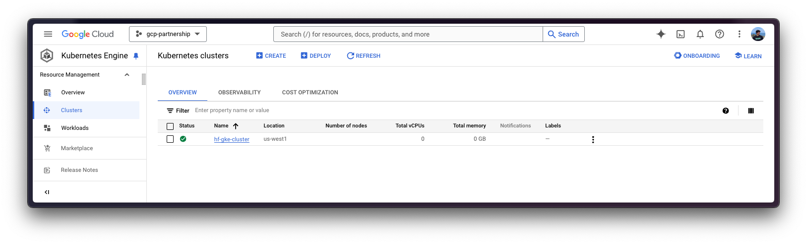
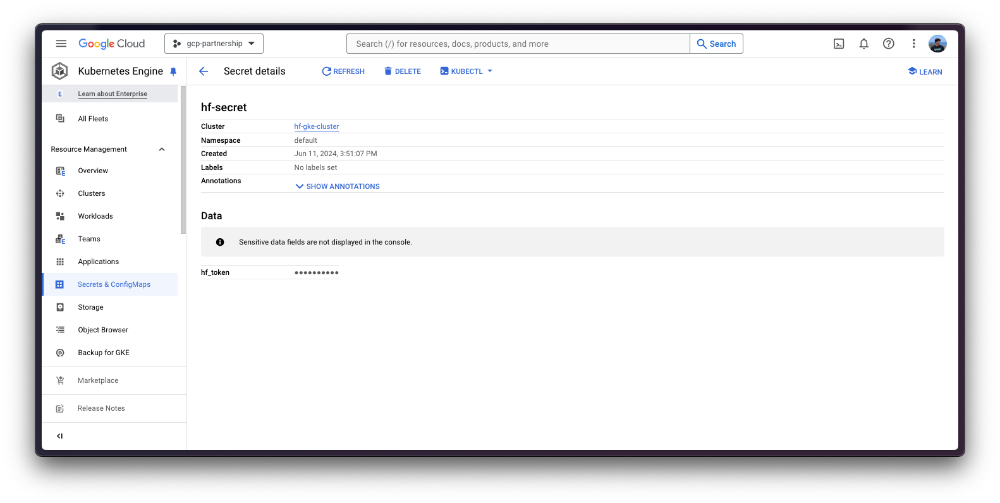
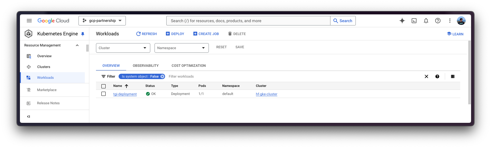

# Deploy Llama 3.2 11B Vision with TGI DLC on GKE

[Llama 3.2](https://huggingface.co/blog/llama32) is the latest release of open LLMs from the Llama family released by Meta (as of October 2024); Llama 3.2 Vision comes in two sizes: 11B for efficient deployment and development on consumer-size GPU, and 90B for large-scale applications. Text Generation Inference (TGI) is a toolkit developed by Hugging Face for deploying and serving LLMs, with high performance text generation. And, Google Kubernetes Engine (GKE) is a fully-managed Kubernetes service in Google Cloud that can be used to deploy and operate containerized applications at scale using Google infrastructure.

This example showcases how to deploy [`meta-llama/Llama-3.2-11B-Vision`](https://huggingface.co/meta-llama/Llama-3.2-11B-Vision) on GKE via the Hugging Face purpose-built Deep Learning Container (DLC) for Text Generation Inference (TGI) on Google Cloud.

> [!WARNING]
> Regarding the licensing terms, Llama 3.2 comes with a very similar license to Llama 3.1, with one key difference in the acceptable use policy: any individual domiciled in, or a company with a principal place of business in, the European Union (EU) is not being granted the license rights to use multimodal models included in Llama 3.2. This restriction does not apply to end users of a product or service that incorporates any such multimodal models, so people can still build global products with the vision variants.
>
> For full details, please make sure to read [the official license](https://huggingface.co/meta-llama/Llama-3.2-1B/blob/main/LICENSE.txt) and [the acceptable use policy](https://huggingface.co/meta-llama/Llama-3.2-1B/blob/main/USE_POLICY.md).

## Setup / Configuration

First, you need to install both `gcloud` and `kubectl` in your local machine, which are the command-line tools for Google Cloud and Kubernetes, respectively, to interact with the GCP and the GKE Cluster.

- To install `gcloud`, follow the instructions at [Cloud SDK Documentation - Install the gcloud CLI](https://cloud.google.com/sdk/docs/install).
- To install `kubectl`, follow the instructions at [Kubernetes Documentation - Install Tools](https://kubernetes.io/docs/tasks/tools/#kubectl).

Optionally, to ease the usage of the commands within this tutorial, you need to set the following environment variables for GCP:

```bash
export PROJECT_ID=your-project-id
export LOCATION=your-location
export CLUSTER_NAME=your-cluster-name
```

Then you need to login into your GCP account and set the project ID to the one you want to use for the deployment of the GKE Cluster.

```bash
gcloud auth login
gcloud auth application-default login  # For local development
gcloud config set project $PROJECT_ID
```

Once you are logged in, you need to enable the necessary service APIs in GCP, such as the Google Kubernetes Engine API, the Google Container Registry API, and the Google Container File System API, which are necessary for the deployment of the GKE Cluster and the Hugging Face DLC for TGI.

```bash
gcloud services enable container.googleapis.com
gcloud services enable containerregistry.googleapis.com
gcloud services enable containerfilesystem.googleapis.com
```

Additionally, to use `kubectl` with the GKE Cluster credentials, you also need to install the `gke-gcloud-auth-plugin`, that can be installed with `gcloud` as follows:

```bash
gcloud components install gke-gcloud-auth-plugin
```

> [!NOTE]
> Installing the `gke-gcloud-auth-plugin` does not need to be installed via `gcloud` specifically, to read more about the alternative installation methods, please visit [GKE Documentation - Install kubectl and configure cluster access](https://cloud.google.com/kubernetes-engine/docs/how-to/cluster-access-for-kubectl#install_plugin).

## Create GKE Cluster

Once everything's set up, you can proceed with the creation of the GKE Cluster on either Autopilot or Standard mode; for Autopilot you just need to create the cluster, and the node pools will be created based on the deployment requirements; whilst on Standard mode you will need to create the node pool yourself, and manage most of the underlying infrastructure.

The "Autopilot" mode will be used as it is the recommended one for most of the workloads, since the underlying infrastructure is managed by Google; but alternatively, you can also use the "Standard" mode.

> [!NOTE]
> Important to check before creating the GKE Autopilot Cluster the [GKE Documentation - Optimize Autopilot Pod performance by choosing a machine series](https://cloud.google.com/kubernetes-engine/docs/how-to/performance-pods), since not all the versions support GPU accelerators e.g. `nvidia-l4` is not supported in the GKE cluster versions 1.28.3 or lower.

```bash
gcloud container clusters create-auto $CLUSTER_NAME \
    --project=$PROJECT_ID \
    --location=$LOCATION \
    --release-channel=stable \
    --cluster-version=1.29 \
    --no-autoprovisioning-enable-insecure-kubelet-readonly-port
```

> [!NOTE]
> To select the specific version in your location of the GKE Cluster, you can run the following command:
>
> ```bash
> gcloud container get-server-config \
>     --flatten="channels" \
>     --filter="channels.channel=STABLE" \
>     --format="yaml(channels.channel,channels.defaultVersion)" \
>     --location=$LOCATION
> ```
>
> For more information please visit [GKE Documentation - Specifying cluster version](https://cloud.google.com/kubernetes-engine/versioning#specifying_cluster_version).



Once the GKE Cluster is created, you can get the credentials to access it via `kubectl` with the following command:

```bash
gcloud container clusters get-credentials $CLUSTER_NAME --location=$LOCATION
```

## Get Hugging Face token and set secrets in GKE

As [`meta-llama/Llama-3.2-11B-Vision-Instruct`](https://huggingface.co/meta-llama/Llama-3.2-11B-Vision-Instruct) is a gated model with restricted access on the European Union (EU), you need to set a Kubernetes secret with the Hugging Face Hub token via `kubectl`.

To generate a custom token for the Hugging Face Hub, you can follow the instructions at [Hugging Face Hub - User access tokens](https://huggingface.co/docs/hub/en/security-tokens); and the recommended way of setting it is to install the `huggingface_hub` Python SDK as follows:

```bash
pip install --upgrade --quiet huggingface_hub
```

And then login in with the generated token with read-access over the gated/private model:

```bash
huggingface-cli login
```

Finally, you can create the Kubernetes secret with the generated token for the Hugging Face Hub as follows using the `huggingface_hub` Python SDK to retrieve the token:

```bash
kubectl create secret generic hf-secret \
    --from-literal=hf_token=$(python -c "from huggingface_hub import get_token; print(get_token())") \
    --dry-run=client -o yaml | kubectl apply -f -
```

Or, alternatively, you can directly set the token as follows:

```bash
kubectl create secret generic hf-secret \
    --from-literal=hf_token=hf_*** \
    --dry-run=client -o yaml | kubectl apply -f -
```



More information on how to set Kubernetes secrets in a GKE Cluster at [Secret Manager Documentation - Use Secret Manager add-on with Google Kubernetes Engine](https://cloud.google.com/secret-manager/docs/secret-manager-managed-csi-component).

## Deploy TGI

Now you can proceed to the Kubernetes deployment of the Hugging Face DLC for TGI, serving the [`meta-llama/Llama-3.2-11B-Vision-Instruct`](https://huggingface.co/meta-llama/Llama-3.2-11B-Vision-Instruct) model from the Hugging Face Hub.

> [!NOTE]
> To explore all the models that can be served via TGI, you can explore [the models tagged with `text-generation-inference` in the Hub](https://huggingface.co/models?other=text-generation-inference); specifically, if you are interested in Vision Language Models (VLMs) you can explore [the models tagged with both `text-generation-inference` and `image-text-to-text` in the Hub](https://huggingface.co/models?pipeline_tag=image-text-to-text&other=text-generation-inference&sort=trending).

The Hugging Face DLC for TGI will be deployed via `kubectl`, from the configuration files in the `config/` directory:

- `deployment.yaml`: contains the deployment details of the pod including the reference to the Hugging Face DLC for TGI setting the `MODEL_ID` to [`meta-llama/Llama-3.2-11B-Vision-Instruct`](https://huggingface.co/meta-llama/Llama-3.2-11B-Vision-Instruct). As the GKE Cluster was deployed in Autopilot mode, the specified resources i.e. 8 x L4s, will be automatically allocated; but if you used the Standard mode instead, you should make sure that your node pool has those GPUs available.

- `service.yaml`: contains the service details of the pod, exposing the port 8080 for the TGI service.

- (optional) `ingress.yaml`: contains the ingress details of the pod, exposing the service to the external world so that it can be accessed via the ingress IP.

```bash
kubectl apply -f config/
```

> [!NOTE]
> The Kubernetes deployment may take a few minutes to be ready, so you can check the status of the deployment with the following command:
>
> ```bash
> kubectl get pods
> ```
>
> As well as checking the logs of the pod that's being deployed with:
>
> ```bash
> kubectl logs -f <POD>
> ```
>
> Alternatively, you can just wait for the deployment to be ready with the following command:
>
> ```bash
> kubectl wait --for=condition=Available --timeout=700s deployment/tgi-deployment
> ```



## Inference with TGI

To run the inference over the deployed TGI service, you can either:

- Port-forwarding the deployed TGI service to the port 8080, so as to access via `localhost` with the command:

  ```bash
  kubectl port-forward service/tgi-service 8080:8080
  ```

- Accessing the TGI service via the external IP of the ingress, which is the default scenario here since you have defined the ingress configuration in the `config/ingress.yaml` file (but it can be skipped in favour of the port-forwarding), that can be retrieved with the following command:

  ```bash
  kubectl get ingress tgi-ingress -o jsonpath='{.status.loadBalancer.ingress[0].ip}'
  ```

### Via cURL

To send a POST request to the TGI service using `cURL`, you can run the following command:

```bash
curl http://localhost:8080/v1/chat/completions \
    -X POST \
    -d '{"messages":[{"role":"user","content":[{"type":"text","text":"What'\''s in this image?"},{"type":"image_url","image_url":{"url":"https://huggingface.co/datasets/huggingface/documentation-images/resolve/main/transformers/rabbit.png"}}]}],"temperature":0.7,"top_p":0.95,"max_tokens":128,"stream":false}' \
    -H 'Content-Type: application/json'
```

Or send a POST request to the ingress IP instead (without specifying the port as it's not needed):

```bash
curl http://$(kubectl get ingress tgi-ingress -o jsonpath='{.status.loadBalancer.ingress[0].ip}')/v1/chat/completions \
    -X POST \
    -d '{"messages":[{"role":"user","content":[{"type":"text","text":"What'\''s in this image?"},{"type":"image_url","image_url":{"url":"https://huggingface.co/datasets/huggingface/documentation-images/resolve/main/transformers/rabbit.png"}}]}],"temperature":0.7,"top_p":0.95,"max_tokens":128,"stream":false}' \
    -H 'Content-Type: application/json'
```

Which generates the following output:

```
{"object":"chat.completion","id":"","created":1728041178,"model":"meta-llama/Llama-3.2-11B-Vision-Instruct","system_fingerprint":"2.3.1-native","choices":[{"index":0,"message":{"role":"assistant","content":"The image shows a rabbit wearing a space suit, standing on a rocky, orange-colored surface. The background is a reddish-brown color with a bright light shining from the right side of the image."},"logprobs":null,"finish_reason":"stop"}],"usage":{"prompt_tokens":43,"completion_tokens":42,"total_tokens":85}}
```

### Via Python

To run the inference using Python, you can either use the [`huggingface_hub` Python SDK](https://github.com/huggingface/huggingface_hub) (recommended) or the [`openai` Python SDK](https://github.com/openai/openai-python).

> [!NOTE]
> In the examples below `localhost` will be used, but if you did deploy TGI with the ingress, feel free to use the ingress IP as mentioned above (without specifying the port).

#### `huggingface_hub`

You can install it via `pip` as `pip install --upgrade --quiet huggingface_hub`, and then run the following snippet to mimic the `cURL` commands above i.e. sending requests to the Messages API:

```python
from huggingface_hub import InferenceClient

client = InferenceClient(base_url="http://localhost:8080", api_key="-")

chat_completion = client.chat.completions.create(
    messages=[
        {
            "role": "user",
            "content": [
                {"type": "text", "text": "What's in this image?"},
                {
                    "type": "image_url",
                    "image_url": {
                        "url": "https://huggingface.co/datasets/huggingface/documentation-images/resolve/main/transformers/rabbit.png"
                    },
                },
            ],
        },
    ],
    max_tokens=128,
)
```

Which generates the following output:

```
ChatCompletionOutput(choices=[ChatCompletionOutputComplete(finish_reason='length', index=0, message=ChatCompletionOutputMessage(role='assistant', content="The image depicts an astronaut rabbit standing on a rocky surface, which is likely Mars or a similar planet. The astronaut's suit takes up most of the shot, with a clear distinction between its lighter parts, such as the chest and limbs, and its darker parts, like the shell that protects it from space's toxic environment. The head portion consists of the full-length helmet that's transparent at the front, allowing the rabbit's face to be visible. \n\nThe astronaut rabbit stands vertically, looking into the distance, its head slightly pointed forward and pointing with its right arm down. Its left arm hangs at its side, adding balance to its stance", tool_calls=None), logprobs=None)], created=1728041247, id='', model='meta-llama/Llama-3.2-11B-Vision-Instruct', system_fingerprint='2.3.1-native', usage=ChatCompletionOutputUsage(completion_tokens=128, prompt_tokens=43, total_tokens=171))
```

#### `openai`

Additionally, you can also use the Messages API via `openai`; you can install it via `pip` as `pip install --upgrade openai`, and then run:

```python
from openai import OpenAI

client = OpenAI(
    base_url="http://localhost:8080/v1/",
    api_key="-",
)

chat_completion = client.chat.completions.create(
    model="tgi",
    messages=[
        {
            "role": "user",
            "content": [
                {"type": "text", "text": "What's in this image?"},
                {
                    "type": "image_url",
                    "image_url": {
                        "url": "https://huggingface.co/datasets/huggingface/documentation-images/resolve/main/transformers/rabbit.png"
                    },
                },
            ],
        },
    ],
    max_tokens=128,
)
```

Which generates the following output:

```
ChatCompletion(id='', choices=[Choice(finish_reason='length', index=0, logprobs=None, message=ChatCompletionMessage(content='The image features an astronaut rabbit on the surface of Mars. Given that rabbits (Oryctolagus cuniculus) are mammals, temperature regulation, gravity, and radiation exposure are all potential hazards in an extraterrestrial space suit designed for a rabbit. As optimal space exploration wear is human-centric, it is challenging to transpose a hypothetical rabbit astronaut suit to adapt to the specialized needs of rabbits.\n\n**Adaptations to Suit Rabbit Physiology**\n\nTo simulate a normalized temperature change, a cooling system designed for thermal comfort could be used. This system might involve a water-based cooling mechanism, similar to a panty hose or suit liner filled with', refusal=None, role='assistant', function_call=None, tool_calls=None))], created=1728041281, model='meta-llama/Llama-3.2-11B-Vision-Instruct', object='chat.completion', service_tier=None, system_fingerprint='2.3.1-native', usage=CompletionUsage(completion_tokens=128, prompt_tokens=43, total_tokens=171))
```

## Other use-cases

Additionally, some potential VLM use-cases, other than image captioning as shown above, are the following:

### Visual Question Answering (VQA)

Given an image and a question about the image, generate an answer to the question.

```
curl http://localhost:8080/v1/chat/completions \
    -X POST \
    -d '{"messages":[{"role":"user","content":[{"type":"text","text":"Which era does this piece belong to? Give details about the era."},{"type":"image_url","image_url":{"url":"https://huggingface.co/datasets/huggingface/release-assets/resolve/main/rococo.jpg"}}]}],"temperature":0.7,"top_p":0.95,"max_tokens":128,"stream":false}' \
    -H 'Content-Type: application/json'
```

For example, given a piece of art you can ask the VLM questions about it.

<table>
    <tr>
        <td></td>
        <td>
            The piece you're referring to is a painting from the Rococo era, specifically from the 18th century. The Rococo style emerged in France in the early 1700s and spread throughout Europe, particularly in Germany and Russia, during the mid-1700s.<br><br>
            <strong>Characteristics of Rococo Art:</strong><br><br>
            <ul>
                <li><strong>Lightness and Airiness:</strong> Rococo art is characterized by its lightness and airiness, often featuring delicate lines, pastel colors, and intricate details.</li>
                <li><strong>Curves and Lines:</strong> Rococo artists favored curves and lines over straight lines, creating a sense of fluidity and movement in their work</li>
            </ul>
        </td>
    </tr>
</table>

### Image Information Retrieval

Given an image, retrieve information from the image.

```
curl http://localhost:8080/v1/chat/completions \
    -X POST \
    -d '{"messages":[{"role":"user","content":[{"type":"text","text":"How long does it take from invoice date to due date? Be short and concise."},{"type":"image_url","image_url":{"url":"https://huggingface.co/datasets/huggingface/release-assets/resolve/main/invoice.png"}}]}],"temperature":0.7,"top_p":0.95,"max_tokens":128,"stream":false}' \
    -H 'Content-Type: application/json'
```

For example, given an invoice, you can ask questions to the VLM asking about information that is either present or can be inferred from the image provided.

<table>
    <tr>
        <td></td>
        <td>
            To calculate the time difference between the invoice date and the due date, we need to subtract the invoice date from the due date.<br><br>
            Invoice Date: 11/02/2019<br>
            Due Date: 26/02/2019<br><br>
            Time Difference = Due Date - Invoice Date<br>
            Time Difference = 26/02/2019 - 11/02/2019<br>
            Time Difference = 15 days<br><br>
            Therefore, it takes <strong>15 days</strong> from the invoice date to the due date.
        </td>
    </tr>
</table>

## Delete GKE Cluster

Finally, once you are done using TGI on the GKE Cluster, you can safely delete the GKE Cluster to avoid incurring in unnecessary costs.

```bash
gcloud container clusters delete $CLUSTER_NAME --location=$LOCATION
```

Alternatively, you can also downscale the replicas to zero in case you want to preserve the cluster, as the GKE Cluster has been deployed on Autopilot mode i.e. node pools are created only when needed and destroyed when not needed; and by default it is just running on a single `e2-small` instance.

```bash
kubectl scale --replicas=0 deployment/tgi-deployment
```
