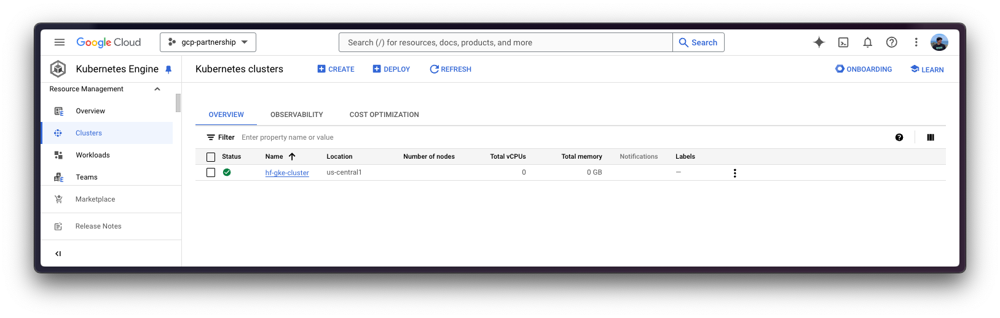
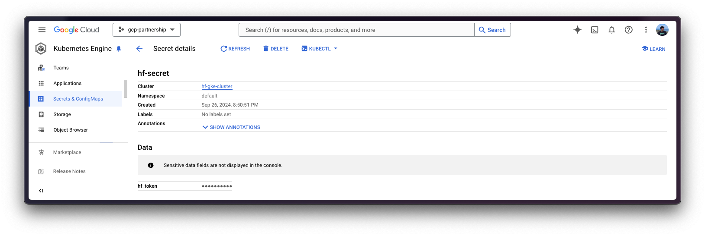
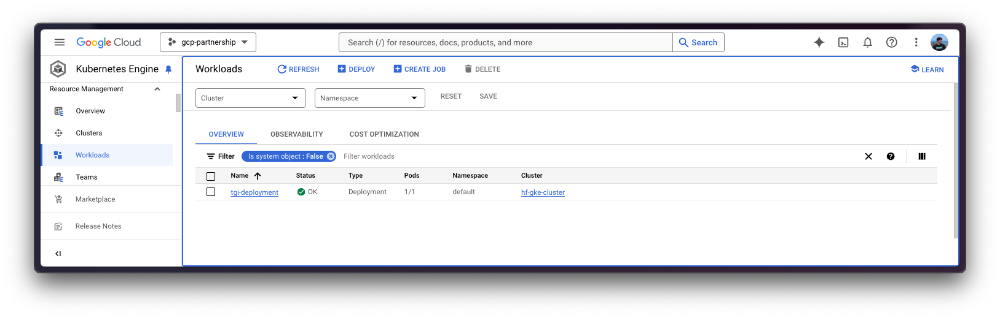

# Deploy Gemma2 with multiple LoRA adapters with TGI DLC on GKE

Gemma 2 is an advanced, lightweight open model that enhances performance and efficiency while building on the research and technology of its predecessor and the Gemini models developed by Google DeepMind and other teams across Google. Text Generation Inference (TGI) is a toolkit developed by Hugging Face for deploying and serving LLMs, with high performance text generation. And, Google Kubernetes Engine (GKE) is a fully-managed Kubernetes service in Google Cloud that can be used to deploy and operate containerized applications at scale using GCP's infrastructure.

This example showcases how to deploy Gemma 2 2B from the Hugging Face Hub with multiple LoRA adapters fine-tuned for different purposes such as coding, SQL, or Japanese, on a GKE Cluster running the Hugging Face DLC for TGI i.e. a purpose-built container to deploy LLMs in a secure and managed environment.

## Setup / Configuration

First, you need to install both `gcloud` and `kubectl` in your local machine, which are the command-line tools for Google Cloud and Kubernetes, respectively, to interact with the GCP and the GKE Cluster.

- To install `gcloud`, follow the instructions at [Cloud SDK Documentation - Install the gcloud CLI](https://cloud.google.com/sdk/docs/install).
- To install `kubectl`, follow the instructions at [Kubernetes Documentation - Install Tools](https://kubernetes.io/docs/tasks/tools/#kubectl).

Optionally, to ease the usage of the commands within this tutorial, you need to set the following environment variables for GCP:

```bash
export PROJECT_ID=your-project-id
export LOCATION=your-location
export CLUSTER_NAME=your-cluster-name
```

Then you need to login into your GCP account and set the project ID to the one you want to use for the deployment of the GKE Cluster.

```bash
gcloud auth login
gcloud auth application-default login  # For local development
gcloud config set project $PROJECT_ID
```

Once you are logged in, you need to enable the necessary service APIs in GCP i.e. the Google Kubernetes Engine API and the Google Container Registry API, which are necessary for the deployment of the GKE Cluster and the Hugging Face DLC for TGI.

```bash
gcloud services enable container.googleapis.com
gcloud services enable containerregistry.googleapis.com
```

Additionally, to use `kubectl` with the GKE Cluster credentials, you also need to install the `gke-gcloud-auth-plugin`, that can be installed with `gcloud` as follows:

```bash
gcloud components install gke-gcloud-auth-plugin
```

> [!NOTE]
> Installing the `gke-gcloud-auth-plugin` does not need to be installed via `gcloud` specifically, to read more about the alternative installation methods, please visit [GKE Documentation - Install kubectl and configure cluster access](https://cloud.google.com/kubernetes-engine/docs/how-to/cluster-access-for-kubectl#install_plugin).

## Create GKE Cluster

Once everything's set up, you can proceed with the creation of the GKE Cluster and the node pool, which in this case will be a single GPU node, in order to use the GPU accelerator for high performance inference, also following TGI recommendations based on their internal optimizations for GPUs.

To deploy the GKE Cluster, the "Autopilot" mode will be used as it is the recommended one for most of the workloads, since the underlying infrastructure is managed by Google. Alternatively, you can also use the "Standard" mode.

> [!NOTE]
> Important to check before creating the GKE Autopilot Cluster the [GKE Documentation - Optimize Autopilot Pod performance by choosing a machine series](https://cloud.google.com/kubernetes-engine/docs/how-to/performance-pods), since not all the versions support GPU accelerators e.g. `nvidia-l4` is not supported in the GKE cluster versions 1.28.3 or lower.

```bash
gcloud container clusters create-auto $CLUSTER_NAME \
    --project=$PROJECT_ID \
    --location=$LOCATION \
    --release-channel=stable \
    --cluster-version=1.29 \
    --no-autoprovisioning-enable-insecure-kubelet-readonly-port
```

> [!NOTE]
> To select the specific version in your location of the GKE Cluster, you can run the following command:
>
> ```bash
> gcloud container get-server-config \
>     --flatten="channels" \
>     --filter="channels.channel=STABLE" \
>     --format="yaml(channels.channel,channels.defaultVersion)" \
>     --location=$LOCATION
> ```
>
> For more information please visit [GKE Documentation - Specifying cluster version](https://cloud.google.com/kubernetes-engine/versioning#specifying_cluster_version).



Once the GKE Cluster is created, you can get the credentials to access it via `kubectl` with the following command:

```bash
gcloud container clusters get-credentials $CLUSTER_NAME --location=$LOCATION
```

## Get Hugging Face token and set secrets in GKE

As [`google/gemma-2-2b-it`](https://huggingface.co/google/gemma-2-2b-it) is a gated model, you need to set a Kubernetes secret with the Hugging Face Hub token via `kubectl`.

To generate a custom token for the Hugging Face Hub, you can follow the instructions at [Hugging Face Hub - User access tokens](https://huggingface.co/docs/hub/en/security-tokens); and the recommended way of setting it is to install the `huggingface_hub` Python SDK as follows:

```bash
pip install --upgrade --quiet huggingface_hub
```

And then login in with the generated token with read-access over the gated/private model:

```bash
huggingface-cli login
```

Finally, you can create the Kubernetes secret with the generated token for the Hugging Face Hub as follows using the `huggingface_hub` Python SDK to retrieve the token:

```bash
kubectl create secret generic hf-secret \
    --from-literal=hf_token=$(python -c "from huggingface_hub import get_token; print(get_token())") \
    --dry-run=client -o yaml | kubectl apply -f -
```

Or, alternatively, you can directly set the token as follows:

```bash
kubectl create secret generic hf-secret \
    --from-literal=hf_token=hf_*** \
    --dry-run=client -o yaml | kubectl apply -f -
```



More information on how to set Kubernetes secrets in a GKE Cluster at [Secret Manager Documentation - Use Secret Manager add-on with Google Kubernetes Engine](https://cloud.google.com/secret-manager/docs/secret-manager-managed-csi-component).

## Deploy TGI

Now you can proceed to the Kubernetes deployment of the Hugging Face DLC for TGI, serving the [`google/gemma-2-2b-it`](https://huggingface.co/google/gemma-2-2b-it) model and multiple LoRA adapters fine-tuned on top of it, from the Hugging Face Hub.

> [!NOTE]
> To explore all the models that can be served via TGI, you can explore [the models tagged with `text-generation-inference` in the Hub](https://huggingface.co/models?other=text-generation-inference).

The Hugging Face DLC for TGI will be deployed via `kubectl`, from the configuration files in the `config/` directory:

- `deployment.yaml`: contains the deployment details of the pod including the reference to the Hugging Face DLC for TGI setting the `MODEL_ID` to [`google/gemma-2-2b-it`](https://huggingface.co/google/gemma-2-2b-it), and the `LORA_ADAPTERS` to `google-cloud-partnership/gemma-2-2b-it-lora-magicoder,google-cloud-partnership/gemma-2-2b-it-lora-sql`, being the following adapters:

  - [`google-cloud-partnership/gemma-2-2b-it-lora-sql`](https://huggingface.co/google-cloud-partnership/gemma-2-2b-it-lora-sql): fine-tuned with [`gretelai/synthetic_text_to_sql`](https://huggingface.co/datasets/gretelai/synthetic_text_to_sql) to generate SQL queries with an explanation, given an SQL context and a prompt / question about it.
  - [`google-cloud-partnership/gemma-2-2b-it-lora-magicoder`](https://huggingface.co/google-cloud-partnership/gemma-2-2b-it-lora-magicoder): fine-tuned with [`ise-uiuc/Magicoder-OSS-Instruct-75K`](https://huggingface.co/datasets/ise-uiuc/Magicoder-OSS-Instruct-75K) to generate code in diverse programming languages such as Python, Rust, or C, among many others; based on an input problem.
  - [`google-cloud-partnership/gemma-2-2b-it-lora-jap-en`](https://huggingface.co/google-cloud-partnership/gemma-2-2b-it-lora-jap-en): fine-tuned with [`Jofthomas/japanese-english-translation`](https://huggingface.co/datasets/Jofthomas/japanese-english-translation), a synthetically generated dataset of short Japanese sentences translated to English; to translate English to Japanese and the other way around.

- `service.yaml`: contains the service details of the pod, exposing the port 8080 for the TGI service.

- (optional) `ingress.yaml`: contains the ingress details of the pod, exposing the service to the external world so that it can be accessed via the ingress IP.

> [!WARNING]
> Note that the selected LoRA adapters are not intended to be used on production environments, as the fine-tuned adapters have not been tested extensively.

```bash
kubectl apply -f config/
```



> [!NOTE]
> The Kubernetes deployment may take a few minutes to be ready, so you can check the status of the deployment with the following command:
>
> ```bash
> kubectl get pods
> ```
>
> Alternatively, you can just wait for the deployment to be ready with the following command:
>
> ```bash
> kubectl wait --for=condition=Available --timeout=700s deployment/tgi-deployment
> ```

## Inference with TGI

To run the inference over the deployed TGI service, you need to make sure that the service is accessible first, you can do so by either:

- Port-forwarding the deployed TGI service to the port 8080, so as to access via `localhost` with the command:

  ```bash
  kubectl port-forward service/tgi-service 8080:8080
  ```

- Accessing the TGI service via the external IP of the ingress, which is the default scenario here since you have defined the ingress configuration in the `config/ingress.yaml` file (but it can be skipped in favour of the port-forwarding), that can be retrieved with the following command:

  ```bash
  kubectl get ingress tgi-ingress -o jsonpath='{.status.loadBalancer.ingress[0].ip}'
  ```

### Via cURL

To send a POST request to the TGI service using `cURL`, you can run the following command:

```bash
curl http://localhost:8080/v1/chat/completions \
    -X POST \
    -d '{"messages":[{"role":"user","content":"What is Deep Learning?"}],"temperature":0.7,"top_p":0.95,"max_tokens":128}}' \
    -H 'Content-Type: application/json'
```

Or send a POST request to the ingress IP instead:

```bash
curl http://$(kubectl get ingress tgi-ingress -o jsonpath='{.status.loadBalancer.ingress[0].ip}')/generate \
    -X POST \
    -d '{"messages":[{"role":"user","content":"What is Deep Learning?"}],"temperature":0.7,"top_p":0.95,"max_tokens":128}}' \
    -H 'Content-Type: application/json'
```

> [!NOTE]
> As in this case you are serving multiple LoRA adapters, to use those you will need to specify the `model` parameter when using the `/v1/chat/completions` endpoint (or the `adapter_id` parameter when using the `/generate` endpoint), so that the LoRA adapter is used. In any other case, the base model will be used instead, meaning that the adapters are only used when explicitly specified.

For example, say that you want to generate a piece of code for a problem that you cannot solve, then you should ideally use the fine-tuned adapter [`google-cloud-partnership/gemma-2-2b-it-lora-magicoder`](https://huggingface.co/google-cloud-partnership/gemma-2-2b-it-lora-magicoder) which is specifically fine-tuned for that; alternatively you could also use the base instruction-tuned model as it may be able to tackle a wide variety of tasks, but e.g. the Japanese to English model wouldn't be a nice pick for that task.

```bash
curl http://localhost:8080/v1/chat/completions \
    -X POST \
    -d '{"messages":[{"role":"user","content":"You are given a vector of integers, A, of length n. Your task is to implement a function that finds the maximum product of any two distinct elements in the vector. Write a function in Rust to return this maximum product. Function Signature: rust fn max_product(a: Vec<i32>) -> i32  Input: - A vector a of length n (2 <= n <= 10^5), where each element is an integer (-10^4 <= a[i] <= 10^4). Output: - Return the maximum product of two distinct elements. Example: Input: a = vec![1, 5, 3, 9] Output: max_product(a) -> 45"}],"temperature":0.7,"top_p":0.95,"max_tokens":256,"model":"google-cloud-partnership/gemma-2-2b-it-lora-magicoder"}}' \
    -H 'Content-Type: application/json'
```

Which generates the following solution to the given prompt:

````
{"object":"chat.completion","id":"","created":1727378101,"model":"google/gemma-2-2b-it","system_fingerprint":"2.3.1-dev0-native","choices":[{"index":0,"message":{"role":"assistant","content":"```rust\nfn max_product(a: Vec<i32>) -> i32 {\n    let mut max1 = a[0];\n    let mut max2 = a[1];\n    if max2 < max1 {\n        std::mem::swap(&mut max1, &mut max2);\n    }\n    for i in 2..a.len() {\n        if a[i] > max1 {\n            max2 = max1;\n            max1 = a[i];\n        } else if a[i] > max2 {\n            "},"logprobs":null,"finish_reason":"length"}],"usage":{"prompt_tokens":163,"completion_tokens":128,"total_tokens":291}}
````

Translated to Rust code that would be:

```rust
fn max_product(a: Vec<i32>) -> i32 {
    if a.len() < 2 {
        return 0;
    }
    let mut max_product = a[0] * a[1];
    for i in 1..a.len() {
        for j in i + 1..a.len() {
            if a[i] * a[j] > max_product {
                max_product = a[i] * a[j];
            }
        }
    }
    max_product
}
```

### Via Python

To run the inference using Python, you can either use the `huggingface_hub` Python SDK (recommended) or the `openai` Python SDK.

> [!NOTE]
> In the examples below `localhost` will be used, but if you did deploy TGI with the ingress, feel free to use the ingress IP as mentioned above (without specifying the port).

#### `huggingface_hub`

You can install it via `pip` as `pip install --upgrade --quiet huggingface_hub`, and then run the following snippet to mimic the `cURL` commands above i.e. sending requests to the Messages API providing the adapter identifier via the `model` parameter:

```python
from huggingface_hub import InferenceClient

client = InferenceClient(base_url="http://localhost:8080", api_key="-")

chat_completion = client.chat.completions.create(
  model="google-cloud-partnership/gemma-2-2b-it-lora-magicoder",
  messages=[
    {"role": "user", "content": "You are given a vector of integers, A, of length n. Your task is to implement a function that finds the maximum product of any two distinct elements in the vector. Write a function in Rust to return this maximum product. Function Signature: rust fn max_product(a: Vec<i32>) -> i32  Input: - A vector a of length n (2 <= n <= 10^5), where each element is an integer (-10^4 <= a[i] <= 10^4). Output: - Return the maximum product of two distinct elements. Example: Input: a = vec![1, 5, 3, 9] Output: max_product(a) -> 45"},
  ],
  max_tokens=128,
)
```

Alternatively, you can also format the prompt yourself and send that via the Text Generation API providing the adapter identifier via the `adapter_id` argument as follows:

```python
from huggingface_hub import InferenceClient

client = InferenceClient("http://localhost:8080", api_key="-")

generation = client.text_generation(
    prompt="You are given a vector of integers, A, of length n. Your task is to implement a function that finds the maximum product of any two distinct elements in the vector. Write a function in Rust to return this maximum product. Function Signature: rust fn max_product(a: Vec<i32>) -> i32  Input: - A vector a of length n (2 <= n <= 10^5), where each element is an integer (-10^4 <= a[i] <= 10^4). Output: - Return the maximum product of two distinct elements. Example: Input: a = vec![1, 5, 3, 9] Output: max_product(a) -> 45",
    max_new_tokens=128,
    adapter_id="google-cloud-partnership/gemma-2-2b-it-lora-magicoder",
)
```

#### `openai`

Additionally, you can also use the Messages API via `openai`; you can install it via `pip` as `pip install --upgrade openai`, and then run:

```python
from openai import OpenAI

client = OpenAI(
    base_url="http://localhost:8080/v1/",
    api_key="-",
)

chat_completion = client.chat.completions.create(
    model="google-cloud-partnership/gemma-2-2b-it-lora-magicoder",
    messages=[
        {"role": "user", "content": "You are given a vector of integers, A, of length n. Your task is to implement a function that finds the maximum product of any two distinct elements in the vector. Write a function in Rust to return this maximum product. Function Signature: rust fn max_product(a: Vec<i32>) -> i32  Input: - A vector a of length n (2 <= n <= 10^5), where each element is an integer (-10^4 <= a[i] <= 10^4). Output: - Return the maximum product of two distinct elements. Example: Input: a = vec![1, 5, 3, 9] Output: max_product(a) -> 45"},
    ],
    max_tokens=128,
)
```

## Delete GKE Cluster

Finally, once you are done using TGI on the GKE Cluster, you can safely delete the GKE Cluster to avoid incurring in unnecessary costs.

```bash
gcloud container clusters delete $CLUSTER_NAME --location=$LOCATION
```

Alternatively, you can also downscale the replicas of the deployed pod to 0 in case you want to preserve the cluster, since the default GKE Cluster deployed with GKE Autopilot mode is running just a single `e2-small` instance.

```bash
kubectl scale --replicas=0 deployment/tgi-deployment
```
