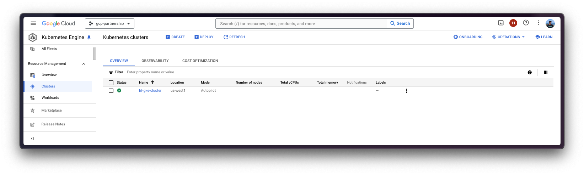
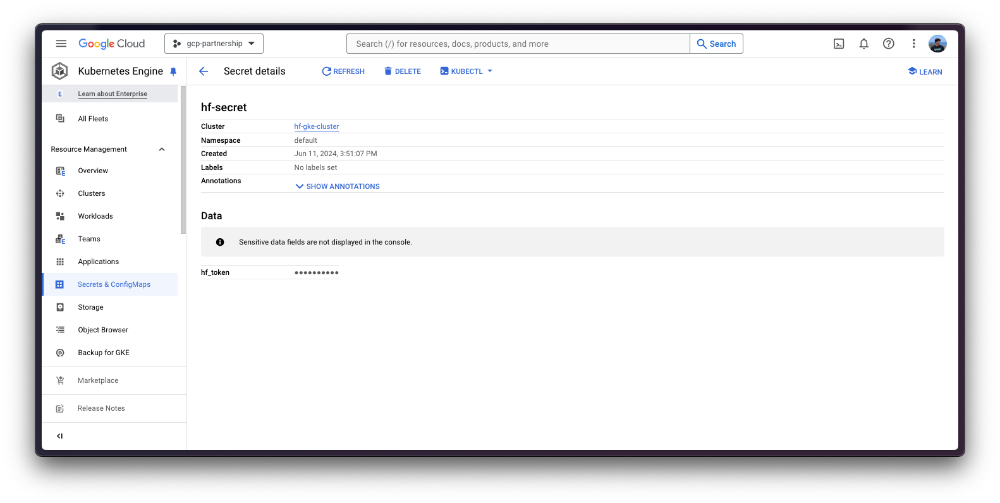
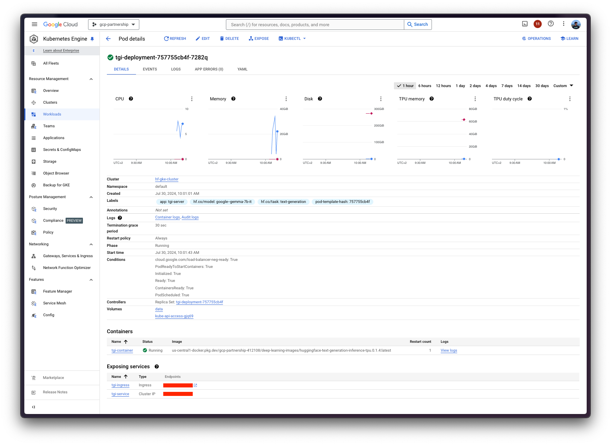

# Deploy Gemma 7B Instruct on TPU with Text Generation Inference in GKE

TL; DR Gemma is a family of lightweight, state-of-the-art open models built from the same research and technology used to create the Gemini models, developed by Google DeepMind and other teams across Google. Text Generation Inference (TGI) is a toolkit developed by Hugging Face for deploying and serving LLMs, with high performance text generation. Tensor Processing Units (TPUs) are Google's custom-developed application-specific integrated circuits (ASICs) used to accelerate machine learning workloads, and Optimum TPU is an open-source library developed by Hugging Face that facilitates the use of Google TPUs for training and deploying machine learning models. Finally, Google Kubernetes Engine (GKE) is a fully-managed Kubernetes service in Google Cloud that can be used to deploy and operate containerized applications at scale using GCP's infrastructure. This post explains how to deploy an LLM from the Hugging Face Hub, as Gemma 7B Instruct, in a GKE Cluster running a purpose-built container to deploy LLMs in a secure and managed environment with the Hugging Face DLC for TGI using TPU v5e chips as the accelerators.

## Setup / Configuration

First, we need to install both `gcloud` and `kubectl` in our local machine, which are the command-line tools for Google Cloud and Kubernetes, respectively, to interact with the GCP and the GKE Cluster.

* To install `gcloud`, follow the instructions at <https://cloud.google.com/sdk/docs/install>.
* To install `kubectl`, follow the instructions at <https://kubernetes.io/docs/tasks/tools/#kubectl>.

Optionally, to ease the usage of the commands within this tutorial, we'll set the following environment variables for GCP:

> [!NOTE]
> As the TPUs are not available in all the regions and zones, it's important to ensure that we select a location that's available within the supported [TPU Regions and Zones](https://cloud.google.com/tpu/docs/regions-zones), for this example we're specially interested in TPU v5e availability.

```bash
export PROJECT_ID="your-project-id"
export LOCATION="your-location"
export CLUSTER_NAME="your-cluster-name"
```

Then we need to login into our GCP account and set the project ID to the one we want to use for the deployment of the GKE Cluster.

```bash
gcloud auth login
gcloud config set project $PROJECT_ID
```

Once we are logged in, we need to enable the necessary services in GCP, such as the Google Kubernetes Engine API, the Google Container Registry API, and the Google Container File System API, which are necessary for the deployment of the GKE Cluster and the Hugging Face DLC for TGI.

```bash
gcloud services enable container.googleapis.com
gcloud services enable containerregistry.googleapis.com
gcloud services enable containerfilesystem.googleapis.com
```

Additionally, in order to use `kubectl` with the GKE Cluster credentials, we also need to install the `gke-gcloud-auth-plugin`, that can be installed with `gcloud` as follows:

```bash
gcloud components install gke-gcloud-auth-plugin
```

> [!NOTE]
> Installing the `gke-gcloud-auth-plugin` does not need to be installed via `gcloud` specifically, to read more about the alternative installation methods, please visit [Install `kubectl` and configure cluster access](https://cloud.google.com/kubernetes-engine/docs/how-to/cluster-access-for-kubectl).

Finally, we also need to ensure that we have enough quota or capacity to create the GKE Cluster with the necessary resources, which can be checked in the GCP Console at <https://console.cloud.google.com/iam-admin/quotas>. In this case, in order to use the TPU v5e we need to check the quota with the following filter `Service: Compute Engine API`, `Type: Quota`, and `Name: TPU v5 Lite PodSlice chips`; and then ensure that we have enough capacity in the selected location by just taking into consideration that the topologies as e.g. `2x4` mean that we need `8` chips available.

## Create GKE Cluster

Once we've set everything up, we are ready to start with the creation of the GKE Cluster and the node pool, which in this case will be a single GPU node, in order to use the GPU accelerator for high performance inference, also following TGI recommendations based on their internal optimizations for GPUs.

In order to deploy the GKE Cluster, we will use the "Autopilot" mode, which is the recommended one for most of the workloads, since the underlying infrastructure is managed by Google. Alternatively, one can also use the "Standard" mode. To check the differences between Autopilot and Standard mode for TPU workloads check either [Deploy TPU workloads in GKE Autopilot](https://cloud.google.com/kubernetes-engine/docs/how-to/tpus-autopilot) or [Deploy TPU workloads in GKE Standard](https://cloud.google.com/kubernetes-engine/docs/how-to/tpus), respectively.

> [!NOTE]
> Before creating the GKE Cluster, either on Autopilot or Standard mode, you should check [About TPUs in GKE](https://cloud.google.com/kubernetes-engine/docs/concepts/tpus) as not all the cluster versions support TPU accelerators, and those are not available in all the locations, so please check [Plan your TPU Configuration](https://cloud.google.com/kubernetes-engine/docs/concepts/tpus#plan-tpu-configuration) for both GKE Autopilot and GKE Standard TPU offerings, as well as checking the supported [TPU Regions and Zones](https://cloud.google.com/tpu/docs/regions-zones) which in this case we're interested in the TPU v5e availability.

```bash
gcloud container clusters create-auto $CLUSTER_NAME \
    --project=$PROJECT_ID \
    --location=$LOCATION \
    --release-channel=stable \
    --cluster-version=1.29
```

> [!NOTE]
> To list the available versions for the GKE Cluster in our location, we can run the following command:
>
> ```bash
> gcloud container get-server-config \
>     --flatten="channels" \
>     --filter="channels.channel=STABLE" \
>     --format="yaml(channels.channel,channels.validVersions)" \
>     --location=$LOCATION
> ```
>
> For more information please visit [GKE Versioning and Support](https://cloud.google.com/kubernetes-engine/versioning).

As of the GKE documentation and service page in GCP, the creation of the GKE Cluster can take 5 minutes or more, depending on the configuration and the location of the cluster.



## Optional: Set Secrets in GKE

Once the GKE Cluster is created then we can already proceed to the TGI deployment, but before that, we will create a Kubernetes secret for the GKE Cluster containing the Hugging Face Hub token, which may not be necessary in most of the cases, but it will be necessary for gated and private models, so we will showcase how to include it in case anyone wants to reproduce with a gated / private model.

In order to set the Kubernetes secret, we first need to get the credentials of the GKE Cluster so that we can access it via `kubectl`:

```bash
gcloud container clusters get-credentials $CLUSTER_NAME --location=$LOCATION
```

Then we can already set the Kubernetes secret with the Hugging Face Hub token via `kubectl`. To generate a custom token for the Hugging Face Hub, you can follow the instructions at <https://huggingface.co/docs/hub/en/security-tokens>.

```bash
kubectl create secret generic hf-secret \
    --from-literal=hf_token=$HF_TOKEN \
    --dry-run=client -o yaml | kubectl apply -f -
```



More information on how to set Kubernetes secrets in a GKE Cluster at [Use Secret Manager add-on with Google Kubernetes Engine](https://cloud.google.com/secret-manager/docs/secret-manager-managed-csi-component).

## Deploy TGI

Once we are all set up, we can proceed to the Kubernetes deployment of the Hugging Face LLM DLC for TGI, serving [`google/gemma-7b-it`](https://huggingface.co/google/gemma-7b-it) from the Hugging Face Hub.

If not ran already within the previous step i.e. [Optional: Set Secrets in GKE](#optional-set-secrets-in-gke), we need to get the credentials of the GKE Cluster so that we can access it via `kubectl`:

```bash
gcloud container clusters get-credentials $CLUSTER_NAME --location=$LOCATION
```

Then we can already deploy the Hugging Face LLM DLC for TGI via `kubectl`, from the following configuration files in the `config/` directory:

* `deployment.yaml`: contains the deployment details of the pod including the reference to the Hugging Face LLM DLC setting the `MODEL_ID` to `google/gemma-7b-it`.
* `service.yaml`: contains the service details of the pod, exposing the port 8080 for the TGI service.
* (optional) `ingress.yaml`: contains the ingress details of the pod, exposing the service to the external world so that it can be accessed via the ingress IP.

```bash
kubectl apply -f config/
```

> [!NOTE]
> The Kubernetes deployment may take a few minutes to be ready, so we can check the status of the deployment with the following command:
>
> ```bash
> kubectl get pods
> ```
>
> Alternatively, we can just wait for the deployment to be ready with the following command:
>
> ```bash
> kubectl wait --for=condition=Available --timeout=700s deployment/tgi-deployment
> ```



## Inference with TGI

In order to run the inference over the deployed TGI service, we can either:

* Port-forwarding the deployed TGI service to the port 8080, so as to access via `localhost` with the command:

    ```bash
    kubectl port-forward service/tgi-service 8080:8080
    ```

* Accessing the TGI service via the external IP of the ingress, which is the default scenario here since we have defined the ingress configuration in the `config/ingress.yaml` file (but it can be skipped in favour of the port-forwarding), that can be retrieved with the following command:

    ```bash
    kubectl get ingress tgi-ingress -o jsonpath='{.status.loadBalancer.ingress[0].ip}'
    ```

### Via cURL

To send a POST request to the TGI service using `cURL`, we can run the following command:

```bash
curl http://localhost:8080/generate \
    -X POST \
    -d '{"inputs":"<bos><start_of_turn>user\nWhat is 2+2?<end_of_turn>\n<start_of_turn>model\n","parameters":{"temperature":0.7, "top_p": 0.95, "max_new_tokens": 128}}' \
    -H 'Content-Type: application/json'
```

Or to send the POST request to the ingress IP:

```bash
curl http://<ingress-ip>/generate \
    -X POST \
    -d '{"inputs":"<bos><start_of_turn>user\nWhat is 2+2?<end_of_turn>\n<start_of_turn>model\n","parameters":{"temperature":0.7, "top_p": 0.95, "max_new_tokens": 128}}' \
    -H 'Content-Type: application/json'
```

Which produces the following output:

```bash
{"generated_text":"Sure, the answer is 4.\n\n2 + 2 = 4<eos>"}⏎
```

> [!NOTE]
> To generate the `inputs` with the expected chat template formatting, one could use the following snippet:
>
> ```python
> from transformers import AutoTokenizer
> tokenizer = AutoTokenizer.from_pretrained("google/gemma-7b-it")
> tokenizer.apply_chat_template(
>     [{"role": "user", "content": "What is 2+2?"}],
>     tokenize=False,
>     add_generation_prompt=True,
> )
> ```

### Via Python

To run the inference using Python, we can use the `openai` Python SDK (see the installation notes at <https://platform.openai.com/docs/quickstart>), setting the ingress IP as the `base_url` for the client, and then running the following code:

```python
import os
from openai import OpenAI

client = OpenAI(
    base_url="http://localhost:8080/v1/",  # or http://<ingress-ip>/v1/
    api_key=os.getenv("HF_TOKEN", "-"),
)

chat_completion = client.chat.completions.create(
    model="tgi",
    messages=[{"role": "user", "content": "What is 2+2?"}],
    max_tokens=128,
)
```

Which produces the following output:

```bash
ChatCompletion(id='', choices=[Choice(finish_reason='eos_token', index=0, message=ChatCompletionMessage(content='Sure, the answer is 4.\n\n2 + 2 = 4<eos>', role='assistant', function_call=None, tool_calls=None), logprobs=None)], created=1722329005, model='google/gemma-7b-it', object='text_completion', system_fingerprint='2.0.2-native', usage=CompletionUsage(completion_tokens=17, prompt_tokens=0, total_tokens=17))
```

## Delete GKE Cluster

Finally, once we are done using TGI in the GKE Cluster, we can safely delete the cluster we've just created to avoid incurring in unnecessary costs.

```bash
gcloud container clusters delete $CLUSTER_NAME --location=$LOCATION
```

Alternatively, we can also downscale the replicas of the deployed pod to 0 in case we want to preserve the cluster, since the default GKE Cluster deployed with GKE Autopilot mode is running just a single `e2-small` instance.

```bash
kubectl scale --replicas=0 deployment/tgi-deployment
```
