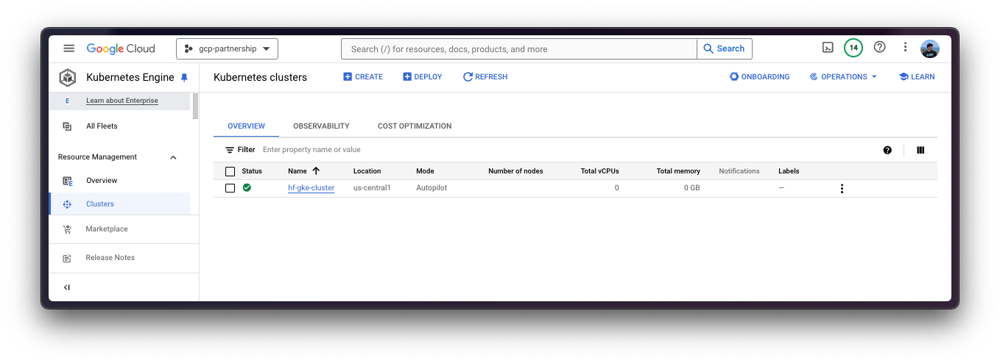
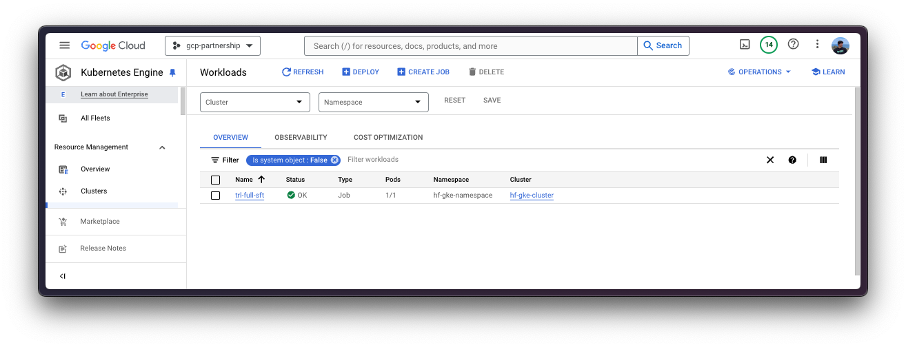
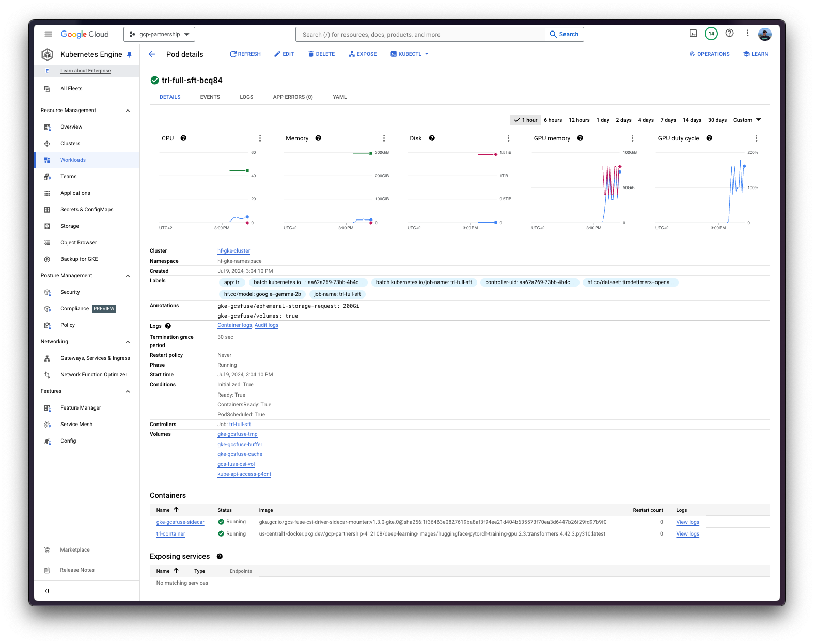
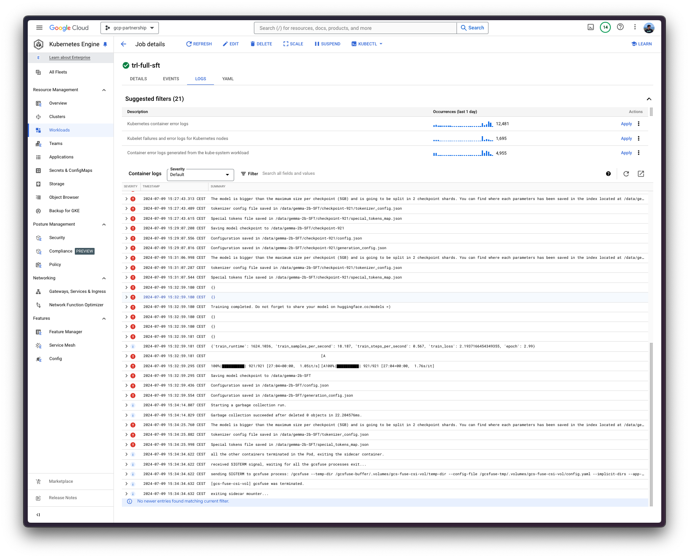
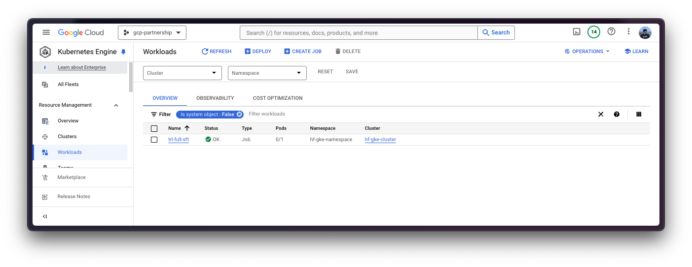
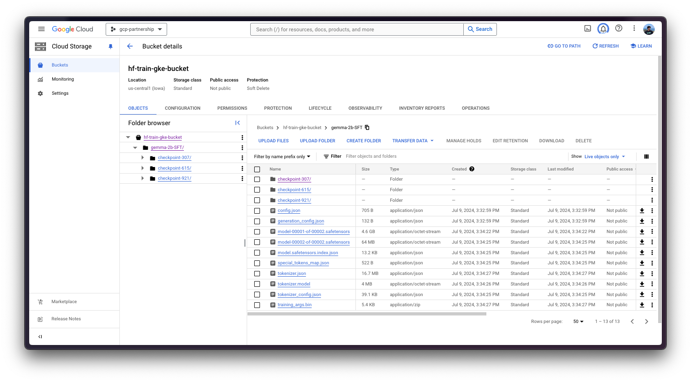

# Fine-tune Gemma 2B with PyTorch Training DLC using SFT on GKE

Gemma is a family of lightweight, state-of-the-art open models built from the same research and technology used to create the Gemini models, developed by Google DeepMind and other teams across Google. TRL is a full stack library to fine-tune and align Large Language Models (LLMs) developed by Hugging Face. And, Google Kubernetes Engine (GKE) is a fully-managed Kubernetes service in Google Cloud that can be used to deploy and operate containerized applications at scale using GCP's infrastructure.

This example showcases how to full fine-tune Gemma 2B with TRL via Supervised Fine-Tuning (SFT) in a multi-GPU setting on a GKE Cluster.

## Setup / Configuration

First, you need to install both `gcloud` and `kubectl` in your local machine, which are the command-line tools for Google Cloud and Kubernetes, respectively, to interact with the GCP and the GKE Cluster.

- To install `gcloud`, follow the instructions at [Cloud SDK Documentation - Install the gcloud CLI](https://cloud.google.com/sdk/docs/install).
- To install `kubectl`, follow the instructions at [Kubernetes Documentation - Install Tools](https://kubernetes.io/docs/tasks/tools/#kubectl).

Optionally, to ease the usage of the commands within this tutorial, you need to set the following environment variables for GCP:

```bash
export PROJECT_ID=your-project-id
export LOCATION=your-location
export CLUSTER_NAME=your-cluster-name
```

Then you need to login into your GCP account and set the project ID to the one you want to use for the deployment of the GKE Cluster.

```bash
gcloud auth login
gcloud auth application-default login  # For local development
gcloud config set project $PROJECT_ID
```

Once you are logged in, you need to enable the necessary service APIs in GCP, such as the Google Kubernetes Engine API, the Google Container Registry API, and the Google Container File System API, which are necessary for the deployment of the GKE Cluster and the Hugging Face DLC for TGI.

```bash
gcloud services enable container.googleapis.com
gcloud services enable containerregistry.googleapis.com
gcloud services enable containerfilesystem.googleapis.com
```

Additionally, to use `kubectl` with the GKE Cluster credentials, you also need to install the `gke-gcloud-auth-plugin`, that can be installed with `gcloud` as follows:

```bash
gcloud components install gke-gcloud-auth-plugin
```

> [!NOTE]
> Installing the `gke-gcloud-auth-plugin` does not need to be installed via `gcloud` specifically, to read more about the alternative installation methods, please visit <https://cloud.google.com/kubernetes-engine/docs/how-to/cluster-access-for-kubectl#install_plugin>.

## Create GKE Cluster

Once everything's set up, you can proceed with the creation of the GKE Cluster and the node pool, which in this case will be a single GPU node, in order to use the GPU accelerator for high performance inference, also following TGI recommendations based on their internal optimizations for GPUs.

To deploy the GKE Cluster, the "Autopilot" mode will be used as it is the recommended one for most of the workloads, since the underlying infrastructure is managed by Google. Alternatively, you can also use the "Standard" mode.

> [!NOTE]
> Important to check before creating the GKE Autopilot Cluster the [GKE Documentation - Optimize Autopilot Pod performance by choosing a machine series](https://cloud.google.com/kubernetes-engine/docs/how-to/performance-pods), since not all the versions support GPU accelerators e.g. `nvidia-l4` is not supported in the GKE cluster versions 1.28.3 or lower.

```bash
gcloud container clusters create-auto $CLUSTER_NAME \
    --project=$PROJECT_ID \
    --location=$LOCATION \
    --release-channel=stable \
    --cluster-version=1.28 \
    --no-autoprovisioning-enable-insecure-kubelet-readonly-port
```

> [!NOTE]
> To select the specific version in your location of the GKE Cluster, you can run the following command:
>
> ```bash
> gcloud container get-server-config \
>     --flatten="channels" \
>     --filter="channels.channel=STABLE" \
>     --format="yaml(channels.channel,channels.defaultVersion)" \
>     --location=$LOCATION
> ```
>
> For more information please visit <https://cloud.google.com/kubernetes-engine/versioning#specifying_cluster_version>.



Once the GKE Cluster is created, you can get the credentials to access it via `kubectl` with the following command:

```bash
gcloud container clusters get-credentials $CLUSTER_NAME --location=$LOCATION
```

## Configure IAM for GCS

Before you run the fine-tuning job of the Hugging Face PyTorch DLC for training on the GKE Cluster, you need to set the IAM permissions for the GCS bucket so that the pod in the GKE Cluster can access the bucket, that will be mounted into the running container and use to write the generated artifacts so that those are automatically uploaded to the GCS Bucket. To do so, you need to create a namespace and a service account in the GKE Cluster, and then set the IAM permissions for the GCS Bucket.

For convenience, as the reference to both the namespace and the service account will be used within the following steps, the environment variables `NAMESPACE` and `SERVICE_ACCOUNT` will be set.

```bash
export NAMESPACE=hf-gke-namespace
export SERVICE_ACCOUNT=hf-gke-service-account
```

Then you can create the namespace and the service account in the GKE Cluster, enabling the creation of the IAM permissions for the pods in that namespace to access the GCS Bucket when using that service account.

```bash
kubectl create namespace $NAMESPACE
kubectl create serviceaccount $SERVICE_ACCOUNT --namespace $NAMESPACE
```

Then you need to add the IAM policy binding to the bucket as follows:

```bash
gcloud storage buckets add-iam-policy-binding \
    gs://$BUCKET_NAME \
    --member "principal://iam.googleapis.com/projects/$(gcloud projects describe $PROJECT_ID --format="value(projectNumber)")/locations/global/workloadIdentityPools/$PROJECT_ID.svc.id.goog/subject/ns/$NAMESPACE/sa/$SERVICE_ACCOUNT" \
    --role "roles/storage.objectUser"
```

## Optional: Set Secrets in GKE

As [`google/gemma-2b`](https://huggingface.co/google/gemma-2b) is a gated model, you need to set a Kubernetes secret with the Hugging Face Hub token via `kubectl`.

To generate a custom token for the Hugging Face Hub, you can follow the instructions at <https://huggingface.co/docs/hub/en/security-tokens>; and the recommended way of setting it is to install the `huggingface_hub` Python SDK as follows:

```bash
pip install --upgrade --quiet huggingface_hub
```

And then login in with the generated token with read-access over the gated/private model:

```bash
huggingface-cli login
```

Finally, you can create the Kubernetes secret with the generated token for the Hugging Face Hub as follows using the `huggingface_hub` Python SDK to retrieve the token:

```bash
kubectl create secret generic hf-secret \
    --from-literal=hf_token=$(python -c "from huggingface_hub import get_token; print(get_token())") \
    --dry-run=client -o yaml \
    --namespace $NAMESPACE | kubectl apply -f -
```

Or, alternatively, you can directly set the token as follows:

```bash
kubectl create secret generic hf-secret \
    --from-literal=hf_token=hf_*** \
    --dry-run=client -o yaml \
    --namespace $NAMESPACE | kubectl apply -f -
```

More information on how to set Kubernetes secrets in a GKE Cluster at <https://cloud.google.com/secret-manager/docs/secret-manager-managed-csi-component>.

## Define Job Configuration

Before proceeding into the Kubernetes deployment of the batch job via the Hugging Face PyTorch DLC for training, you need to define first the configuration required for the job to run successfully i.e. which GPU is capable of fine-tuning [`google/gemma-2b`](https://huggingface.co/google/gemma-2b) in `bfloat16`.

As a rough calculation, you could assume that the amount of GPU VRAM required to fine-tune a model in half precision is about four times the model size (read more about it in [Eleuther AI - Transformer Math 101](https://blog.eleuther.ai/transformer-math/)).

Alternatively, if your model is uploaded to the Hugging Face Hub, you can check the numbers in the community space [`Vokturz/can-it-run-llm`](https://huggingface.co/spaces/Vokturz/can-it-run-llm), which does those calculations for you, based the model to fine-tune and the available hardware.


## Run Job

Now you can already run the Kubernetes job in the Hugging Face PyTorch DLC for training on the GKE Cluster via `kubectl` from the [`job.yaml`](./job.yaml) configuration file, that contains the job specification for running the command `trl sft` provided by the TRL CLI for the SFT full fine-tuning of [`google/gemma-2b`](https://huggingface.co/google/gemma-2b) in `bfloat16` using [`timdettmers/openassistant-guanaco`](https://huggingface.co/datasets/timdettmers/openassistant-guanaco), which is a subset from [`OpenAssistant/oasst1`](https://huggingface.co/datasets/OpenAssistant/oasst1) with ~10k samples in 4 x A100 40GiB GPUs, storing the generated artifacts into a volume mount under `/data` linked to a GCS Bucket.

```bash

```

```bash
git clone https://github.com/huggingface/Google-Cloud-Containers
kubectl apply -f Google-Cloud-Containers/examples/gke/trl-full-fine-tuning/job.yaml
```





> [!NOTE]
> In this case, since you are running a batch job, it will only use one node as specified within the [`job.yaml`](./job.yaml) file, since you don't need anything else than that. So on, the job will deploy one pod running the `trl sft` command on top of the Hugging Face PyTorch DLC container for training, and also the GCS FUSE container that is mounting the GCS Bucket into the `/data` path so as to store the generated artifacts in GCS. Once the job is completed, it will automatically scale back to 0, meaning that it will not consume resources.

Additionally, you can use `kubectl` to stream the logs of the job as it follows:

```bash
kubectl logs -f job/trl-full-sft --container trl-container --namespace $NAMESPACE
```

Finally, once the job is completed, the pods will scale to 0 and the artifacts will be visible in the GCS Bucket mounted within the job.







## Delete GKE Cluster

Finally, once the fine-tuning job is completed, you can safely delete the GKE Cluster to avoid incurring in unnecessary costs.

```bash
gcloud container clusters delete $CLUSTER_NAME --location=$LOCATION
```

Alternatively, you may decide to keep the GKE Cluster running even after the job is completed, since the default GKE Cluster deployed with GKE Autopilot mode is running just a single `e2-small` instance.
