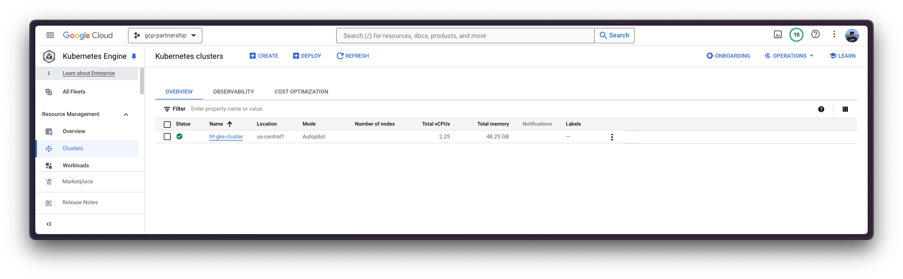
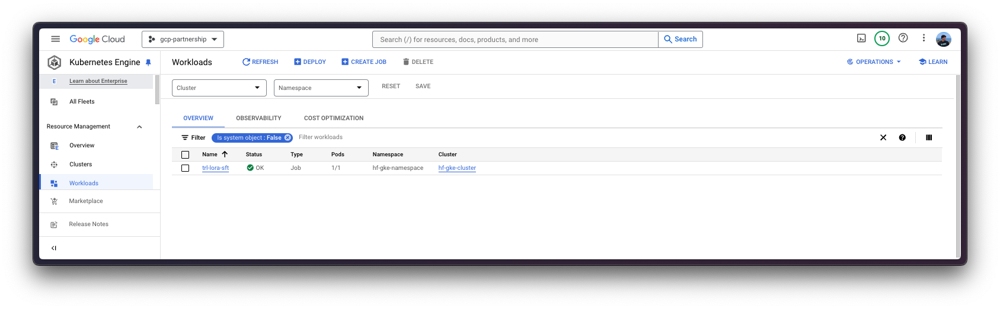
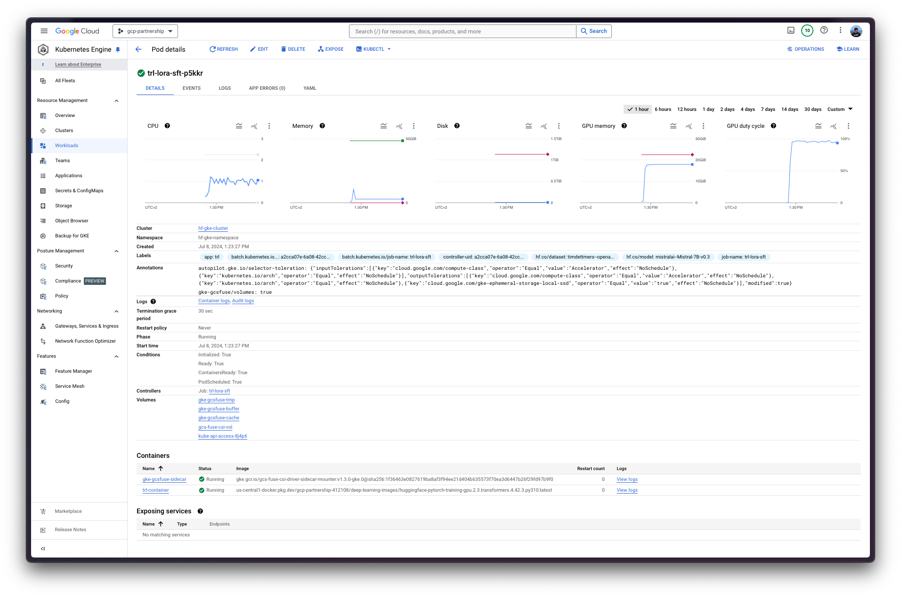
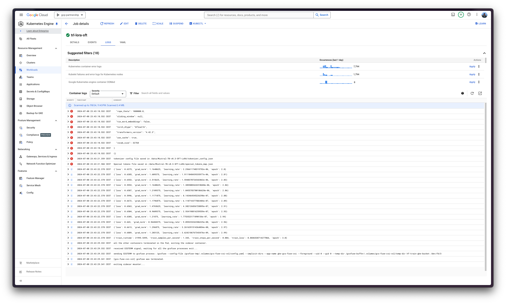
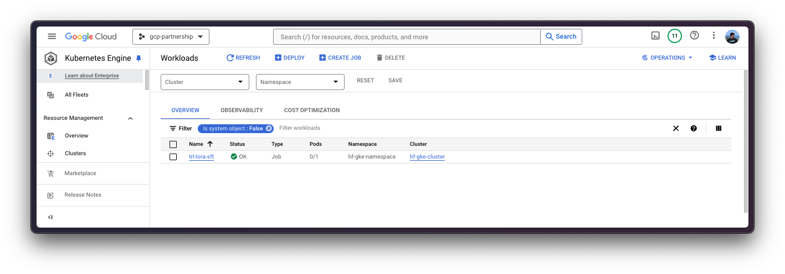
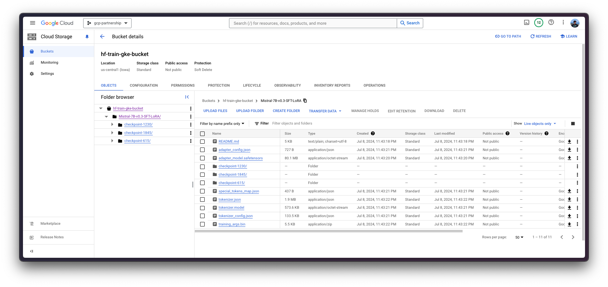

# Fine-tune Mistral 7B v0.3 with TRL in GKE

TL; DR And, Google Kubernetes Engine (GKE) is a fully-managed Kubernetes service in Google Cloud that can be used to deploy and operate containerized applications at scale using GCP's infrastructure. This post explains how to ...

## Setup / Configuration

First, we need to install both `gcloud` and `kubectl` in our local machine, which are the command-line tools for Google Cloud and Kubernetes, respectively, to interact with the GCP and the GKE Cluster.

* To install `gcloud`, follow the instructions at <https://cloud.google.com/sdk/docs/install>.
* To install `kubectl`, follow the instructions at <https://kubernetes.io/docs/tasks/tools/#kubectl>.

Optionally, to ease the usage of the commands within this tutorial, we'll set the following environment variables for GCP:

```bash
export PROJECT_ID="your-project-id"
export LOCATION="your-location"
export CLUSTER_NAME="your-cluster-name"
```

> [!NOTE]
> You may be used to using `REGION` and `ZONE` in GCP, but in this case we will use `LOCATION` instead, which is essentially the same, but it's now the recommended way to refer to the location of the resources in GKE.

Then we need to login into our GCP account and set the project ID to the one we want to use for the deployment of the GKE Cluster.

```bash
gcloud auth login
gcloud config set project $PROJECT_ID
```

Once we are logged in, we need to enable the necessary services in GCP, such as the Google Kubernetes Engine API, the Google Container Registry API, and the Google Container File System API, which are necessary for the deployment of the GKE Cluster and the Hugging Face DLC for training.

```bash
gcloud services enable container.googleapis.com
gcloud services enable containerregistry.googleapis.com
gcloud services enable containerfilesystem.googleapis.com
```

Additionally, in order to use `kubectl` with the GKE Cluster credentials, we also need to install the `gke-gcloud-auth-plugin`, that can be installed with `gcloud` as follows:

```bash
gcloud components install gke-gcloud-auth-plugin
```

> [!NOTE]
> Installing the `gke-gcloud-auth-plugin` does not need to be installed via `gcloud` specifically, to read more about the alternative installation methods, please visit <https://cloud.google.com/kubernetes-engine/docs/how-to/cluster-access-for-kubectl#install_plugin>.

## Create GKE Cluster

Once we've set everything up, we are ready to start with the creation of the GKE Cluster and the node pool, which in this case will be a single GPU node to fine-tune Mistral 7B v0.3 with SFT + LoRA using TRL's CLI.

In order to deploy the GKE Cluster, we will use the "Autopilot" mode, which is the recommended one for most of the workloads, since the underlying infrastructure is managed by Google. Alternatively, one can also use the "Standard" mode.

> [!NOTE]
> Important to check before creating the GKE Autopilot Cluster <https://cloud.google.com/kubernetes-engine/docs/how-to/autopilot-gpus#before_you_begin>, since not all the versions support GPU accelerators e.g. `nvidia-l4` is not supported in the GKE cluster versions 1.28.3 or lower.

```bash
gcloud container clusters create-auto $CLUSTER_NAME \
    --project=$PROJECT_ID \
    --location=$LOCATION \
    --release-channel=stable \
    --cluster-version=1.28
```

> [!NOTE]
> To select the specific version in our location of the GKE Cluster, we can run the following command:
>
> ```bash
> gcloud container get-server-config \
>     --flatten="channels" \
>     --filter="channels.channel=STABLE" \
>     --format="yaml(channels.channel,channels.defaultVersion)" \
>     --location=$LOCATION
> ```
>
> For more information please visit <https://cloud.google.com/kubernetes-engine/versioning#specifying_cluster_version>.

As of the GKE documentation and service page in GCP, the creation of the GKE Cluster can take 5 minutes or more, depending on the configuration and the location of the cluster.



## Configure IAM for GCS

Before we proceed with the deployment of the job with the Hugging Face PyTorch DLC for training in the GKE Cluster, we need to set the IAM permissions for the GCS bucket so that the pod in the GKE Cluster can access the bucket, that will be mounted into the running container and use to write the generated artifacts so that those are automatically uploaded to the GCS Bucket. To do so, we will create a namespace and a service account in the GKE Cluster, and then set the IAM permissions for the GCS Bucket.

In order to set the Kubernetes secret, we first need to get the credentials of the GKE Cluster so that we can access it via `kubectl`:

```bash
gcloud container clusters get-credentials $CLUSTER_NAME --location=$LOCATION
```

> [!NOTE]
> The `gcloud container clusters get-credentials` command will set the `kubectl` context to the GKE Cluster, so that we can interact with the cluster via `kubectl`, meaning it will be required for the rest of the tutorial, but only needs to be ran once, that's why in the following steps we will not include it in the commands as we're assuming it's already set.

Since we will be referring to the namespace and the service account in the upcoming steps, we will set the environment variables `NAMESPACE` and `SERVICE_ACCOUNT` to the name of the namespace and the service account we want to use for the deployment of the model.

```bash
export NAMESPACE="hf-gke-namespace"
export SERVICE_ACCOUNT="hf-gke-service-account"
```

Then we can create the namespace and the service account in the GKE Cluster, so that we can then create the IAM permissions for the pods in that namespace to read/write access the GCS Bucket when using that service account.

```bash
kubectl create namespace $NAMESPACE
kubectl create serviceaccount $SERVICE_ACCOUNT --namespace $NAMESPACE
```

Then we add the IAM policy binding to the bucket as follows:

```bash
gcloud storage buckets add-iam-policy-binding \
    gs://$BUCKET_NAME \
    --member "principal://iam.googleapis.com/projects/$(gcloud projects describe $PROJECT_ID --format="value(projectNumber)")/locations/global/workloadIdentityPools/$PROJECT_ID.svc.id.goog/subject/ns/$NAMESPACE/sa/$SERVICE_ACCOUNT" \
    --role "roles/storage.objectUser"
```

> [!NOTE]
> We are setting the role for the IAM over the bucket to `roles/storage.objectUser`, which means that read/write access will be granted, since in this case we will be using the GCS Bucket to store the generated artifacts during and after the fine-tuning.

## Deploy fine-tuning job

Once we are all set up, we can proceed to the Kubernetes deployment of the Hugging Face PyTorch DLC for training, which will run a batch job within the cluster running the Supervised Fine-Tuning SFT with LoRA on [`mistralai/Mistral-7B-v0.3`](https://huggingface.co/mistralai/Mistral-7B-v0.3) with LoRA in `bfloat16` using [`timdettmers/openassistant-guanaco`](https://huggingface.co/timdettmers/openassistant-guanaco), which is a subset from [`OpenAssistant/oasst1`](https://huggingface.co/datasets/OpenAssistant/oasst1) with ~10k samples, with a single GPU, and will store the generated artifacts into a volume mount under `/data` linked to a GCS Bucket.

Before proceeding, we need to first determine which GPU is suitable and capable of fine-tuning a 7B LLM on a single GPU, for that, we can either do a rough calculation of needing ~4 times the model size in GPU memory (read more about it in [Eleuther AI - Transformer Math 101](https://blog.eleuther.ai/transformer-math/)), or, if your model is uploaded to the Hugging Face Hub, just check the numbers in [Vokturz/can-it-run-llm](https://huggingface.co/spaces/Vokturz/can-it-run-llm).


Then we can already trigger the Hugging Face PyTorch DLC for training via `kubectl` from the `job.yaml` configuration file that contains the job specification  running the command `trl sft` provided by the TRL CLI with the settings mentioned above.

```bash
kubectl apply -f job.yaml
```





> [!NOTE]
> In this case, since we're running a batch job, it will only use one node as specified within the `job.yaml` file, since we don't need anything else than that. So on, the job will deploy one pod running the `trl sft` command on top of the Hugging Face PyTorch DLC container for training, and also the GCS FUSE container that is mounting the GCS Bucket into the `/data` path so as to store the generated artifacts in GCS. So on, in this case, we don't care about scaling, we just need to trigger the job and wait until it's done; which once done, it will automatically scale back to 0, meaning that it won't consume resources.

Finally, once the job is completed, the pods will scale to 0 and the artifacts will be visible in the GCS Bucket mounted within the job.







## Delete GKE Cluster

Finally, once the fine-tuning job is done, we can safely delete the GKE Cluster we've just created to avoid incurring in unnecessary costs.

```bash
gcloud container clusters delete $CLUSTER_NAME --location=$LOCATION
```

Alternatively, one may decide to keep the GKE Cluster running even when the job is done, since the default GKE Cluster deployed with GKE Autopilot mode is running just a single `e2-small` instance.
